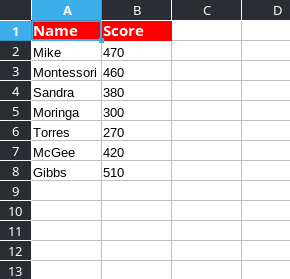
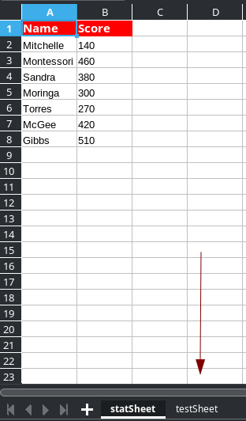
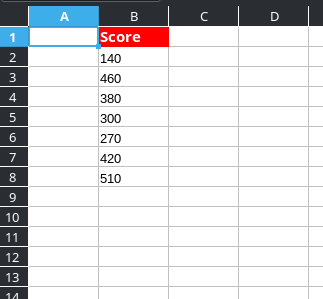

### Introduction

A good application should be able to handle all CRUD operations. Owing to that, we will build upon [this](https://www.section.io/engineering-education/android-excel-apachepoi/) article which talks about creating and reading Spreadsheets created using the Apache POI library. We will have a walkthrough on editing cells, renaming columns, deleting sheets & workbooks, etc.

### Prerequisites

> **NOTE**: Since we will add more code to the linked project, it is necessary to have a look at it. It’s a continuation of the application, and it will be hard to follow through with this one if you haven’t looked at the tutorial.

The requirements of both tutorials are the same, which are:

1. An understanding of Kotlin
2. A basic understanding of Excel/Spreadsheets
3. An understanding of Android development environments.

### An overview of what we will be doing

We will add header cells to the table we created and format the cells. Secondly, we will have a walkthrough on editing the values of cells. Thirdly, we will look at a worksheet deletion. Finally, we will look at the deletion of rows and columns. All these actions are easily achieved using the Apache POI. Let’s start.

### Adding and formatting header cells

We have to add a row at the top of the cells we created. There are a bunch of ways to do this, one of which is a loop. In the loop, we simply assign the row indices to the next indices, appropriately set the values, and then add the header values. However, we won't be using the looping approach in order to simplify things. Also, we have few records, so we will manually shift the rows and add the header row to the top. Therefore, modify the `addData()` method to this:

```kotlin
   private fun addData(sheet: Sheet) {

        //Creating rows at passed in indices
        val row1 = sheet.createRow(0)
        val row2 = sheet.createRow(1)
        val row3 = sheet.createRow(2)
        val row4 = sheet.createRow(3)
        val row5 = sheet.createRow(4)
        val row6 = sheet.createRow(5)
        val row7 = sheet.createRow(6)
        val row8 = sheet.createRow(7)


        //Adding data to each  cell
        createCell(row1, 0, "Name")
        createCell(row1, 1, "Score")

        createCell(row2, 0, "Mike")
        createCell(row2, 1, "470")

        createCell(row3, 0, "Montessori")
        createCell(row3, 1, "460")

        createCell(row4, 0, "Sandra")
        createCell(row4, 1, "380")

        createCell(row5, 0, "Moringa")
        createCell(row5, 1, "300")

        createCell(row6, 0, "Torres")
        createCell(row6, 1, "270")

        createCell(row7, 0, "McGee")
        createCell(row7, 1, "420")

        createCell(row8, 0, "Gibbs")
        createCell(row8, 1, "510")

    }
```

We have incremented the row indices and added a header row to the top.

#### Formatting the cells

Let’s now format the header cells. This will be done after accessing a sheet, which we discussed in the previous article.

> I will first discuss the code in bits, step by step, then show the full code in the end.

We access the header cells in this manner:

```kotlin
//choosing the first row as the headers
var nameHeaderCell = sheet.getRow(0).getCell(0)
var scoreHeaderCell = sheet.getRow(0).getCell(1)
```

Then, we create a font object for setting the font properties.

```kotlin
val font: Font = workbook.createFont()
```

We bolden the font and add set the font color to white since we will be setting a red background to the header cells.

```kotlin
//choosing white color and a bold formatting
font.color = IndexedColors.WHITE.index
font.bold = true
```

A style object for accessing formatting properties such as alignment, background color, etc is created this way:

```kotlin
val headerCellStyle = workbook.createCellStyle()
```

After the style object creation, we set a left alignment, a red background color, and the fill type to solid. You can explore these and more formatting properties in the official Apache POI docs.

```kotlin
//applying formatting styles to the cells
headerCellStyle.setAlignment(HorizontalAlignment.LEFT)
headerCellStyle.fillForegroundColor = IndexedColors.RED.index
headerCellStyle.setFillPattern(FillPatternType.SOLID_FOREGROUND)
```

To set the font properties we use the `setFont()` method and pass in the font object we created beforehand.

```kotlin
headerCellStyle.setFont(font);
```

Finally, we set the header cell styles using the cellStyle property as shown:

```kotlin
nameHeaderCell.cellStyle = headerCellStyle
scoreHeaderCell.cellStyle = headerCellStyle
```



_Screenshot after the formatting_

Now, to utilize the same sheet without creating another function, we will add more code to the function to update cell labels and values.

### Editing Cell Labels and Values

We first access the rows and cells we want. Note that for your app, this should be done dynamically and not hard coding the indices as I have done here.

```kotlin
//selecting cells to be editted and formatted
var targetCellLabel = sheet.getRow(1).getCell(0)
var targetCellValue = sheet.getRow(1).getCell(1)
```

We set the alignment to the left to achieve uniformity.

```kotlin
val targetCellDataStyle = workbook.createCellStyle()
```

Setting the values is done this way.

```kotlin
targetCellDataStyle.setAlignment(HorizontalAlignment.LEFT)
targetCellValue.cellStyle = targetCellDataStyle
targetCellLabel.cellStyle = targetCellDataStyle
```

After the edits, we have to close the input stream and then save the file.

```kotlin
//close
workbookStream.close()

//save
val fileOut = FileOutputStream(it)
workbook.write(fileOut)
fileOut.close()
```

We will achieve this in the end.


This is the full code for the method:

```kotlin
    private fun updateCell() {
        getExcelFile()?.let {
            try {

                //Reading it as stream
                val workbookStream = FileInputStream(it)

                //Return the loaded workbook
                val workbook = WorkbookFactory.create(workbookStream)
                if (workbook.numberOfSheets > 0) {

                    //Return the first sheet
                    val sheet = workbook.getSheetAt(0)
                    //choosing the first row as the headers
                    var nameHeaderCell = sheet.getRow(0).getCell(0)
                    var scoreHeaderCell = sheet.getRow(0).getCell(1)

                    //selecting cells to be editted and formatted
                    var targetCellLabel = sheet.getRow(1).getCell(0)
                    var targetCellValue = sheet.getRow(1).getCell(1)

                    val font: Font = workbook.createFont()
                    val headerCellStyle = workbook.createCellStyle()
                    val targetCellDataStyle = workbook.createCellStyle()

                    //choosing white color and a bold formatting
                    font.color = IndexedColors.WHITE.index
                    font.bold = true

                    //applying formatting styles to the cells
                    headerCellStyle.setAlignment(HorizontalAlignment.LEFT)
                    headerCellStyle.fillForegroundColor = IndexedColors.RED.index
                    headerCellStyle.setFillPattern(FillPatternType.SOLID_FOREGROUND)
                    headerCellStyle.setFont(font);
                    nameHeaderCell.cellStyle = headerCellStyle
                    scoreHeaderCell.cellStyle = headerCellStyle

                    targetCellDataStyle.setAlignment(HorizontalAlignment.LEFT)
                    targetCellValue.cellStyle = targetCellDataStyle
                    targetCellLabel.cellStyle = targetCellDataStyle

                    //feeding in new values to the selected cells
                    targetCellLabel.setCellValue("Mitchelle")
                    targetCellValue.setCellValue(140.0)

                    workbookStream.close()

                    //saving the changes
                    try {
                        val fileOut = FileOutputStream(it)
                        workbook.write(fileOut)
                        fileOut.close()
                    } catch (e: FileNotFoundException) {
                        e.printStackTrace()
                    } catch (e: IOException) {
                        e.printStackTrace()
                    }
                }
            } catch (e: Exception) {
                e.printStackTrace()
            }
        }
    }
```

### Deleting a sheet

We will create a new sheet for the test deletion. In the `createWorkbook()` method, we will add a line for creating a new sheet called _testSheet_.

```kotlin
    private fun createWorkbook(): Workbook {

        ....
        ourWorkbook.createSheet("testSheet")
        ....

    }
```



_The created sheet_

A method called `deleteSheet()` is used for the deletion task, where we will call the `removeSheetAt(positionIndex)` method.

```kotlin
    private fun deleteSheet() {
        getExcelFile()?.let {
            try {

                //Reading it as stream
                val workbookStream = FileInputStream(it)

                //Return the loaded workbook
                val workbook = WorkbookFactory.create(workbookStream)
                if (workbook.numberOfSheets > 0) {
                    //removing the second sheet
                    workbook.removeSheetAt(1)
                    workbookStream.close()

                    try {
                        val fileOut = FileOutputStream(it)
                        workbook.write(fileOut)
                        fileOut.close()
                    } catch (e: FileNotFoundException) {
                        e.printStackTrace()
                    } catch (e: IOException) {
                        e.printStackTrace()
                    }
                }
            } catch (e: Exception) {
                e.printStackTrace()
            }
        }
    }
```

When we run the code and access the file, we wont see the sheet:


### Deleting a row

After accessing the row, we delete it using the `removeRow()` method. This is after confirming if it’s not empty using an `if` conditional statement.

```kotlin
val targetRow = sheet.getRow(rowNo)
if (targetRow != null) {
    sheet.removeRow(targetRow)
}
```

Thereafter, we shift the cells that are after it one step backward using the `shiftRows()` method. This method takes in three parameters namely, the row index to start shifting from, the total number of rows to shift, and a step number respectively. That’s why we needed to access the total number of rows using the `totalNoOfRows` variable.

```kotlin
/*excluding the last row, move the cells that come
    after the deleted row one step behind*/
if (rowNo >= 0 && rowNo < totalNoOfRows) {
    sheet.shiftRows(rowNo + 1, totalNoOfRows, -1)
}
```


_Screenshot after deletion_

The full code:

```kotlin
    private fun deleteRow() {
        getExcelFile()?.let {
            try {
                val rowNo = 1
                //Reading it as stream
                val workbookStream = FileInputStream(it)

                //Return the loaded workbook
                val workbook = WorkbookFactory.create(workbookStream)
                if (workbook.numberOfSheets > 0) {

                    //Return the first sheet
                    val sheet = workbook.getSheetAt(0)

                    //getting the total number of rows available
                    val totalNoOfRows = sheet.lastRowNum

                    val targetRow = sheet.getRow(rowNo)
                    if (targetRow != null) {
                        sheet.removeRow(targetRow)
                    }

                    /*excluding the last row, move the cells that come
                    after the deleted row one step behind*/
                    if (rowNo >= 0 && rowNo < totalNoOfRows) {
                        sheet.shiftRows(rowNo + 1, totalNoOfRows, -1)
                    }
                    workbookStream.close()

                    try {
                        val fileOut = FileOutputStream(it)
                        workbook.write(fileOut)
                        fileOut.close()
                    } catch (e: FileNotFoundException) {
                        e.printStackTrace()
                    } catch (e: IOException) {
                        e.printStackTrace()
                    }
                }
            } catch (e: Exception) {
                e.printStackTrace()
            }
        }
    }
```

### Deleting Columns

This is a little bit complicated than the previous ones. We have to first get the number of columns available. We have to do this because we will get an error when trying to delete an empty column or when we want to perform a shift function. We won't do the shift here. I will leave it up to you to get some coffee and implement it.

We get the total number of columns by getting the number of the last cell of a row.

```kotlin
val row = sheet.getRow(colNo)
val maxCell = row.lastCellNum.toInt()
```

After checking the validity of a column number, we use a loop to iterate through the column while deleting the cells.

```kotlin
if (colNo >= 0 && colNo <= maxCell) {
   for (rowNo in 0..totalRows) {
        val targetCol: Cell = sheet.getRow(rowNo).getCell(colNo)
        if (targetCol != null) {
            sheet.getRow(rowNo).removeCell(targetCol);
        }
    }
}
```

This is the full code:

```kotlin
    private fun deleteColumn() {
        getExcelFile()?.let {
            try {
                val colNo = 0
                //Reading it as stream
                val workbookStream = FileInputStream(it)

                //Return the loaded workbook
                val workbook = WorkbookFactory.create(workbookStream)
                if (workbook.numberOfSheets > 0) {

                    //Return the first sheet
                    val sheet = workbook.getSheetAt(0)
                    val totalRows = sheet.lastRowNum
                    val row = sheet.getRow(colNo)
                    val maxCell = row.lastCellNum.toInt()
                    if (colNo >= 0 && colNo <= maxCell) {
                        for (rowNo in 0..totalRows) {
                            val targetCol: Cell = sheet.getRow(rowNo).getCell(colNo)
                            if (targetCol != null) {
                                sheet.getRow(rowNo).removeCell(targetCol);
                            }
                        }
                    }
                    workbookStream.close()

                    try {
                        val fileOut = FileOutputStream(it)
                        workbook.write(fileOut)
                        fileOut.close()
                    } catch (e: FileNotFoundException) {
                        e.printStackTrace()
                    } catch (e: IOException) {
                        e.printStackTrace()
                    }
                }
            } catch (e: Exception) {
                e.printStackTrace()
            }
        }
    }
```

We will achieve this:



That is it.

### Further Practice

Apache POI provides a countless number of methods that are to be explored. For this tutorial, we could add table borders, footers, rename a workbook, delete a workbook, rename a sheet, italicize, set different font families, etc. I encourage you to have a look at the [official documentation](https://poi.apache.org/components/spreadsheet/index.html) and this [JavaTPoint blog](https://www.javatpoint.com/apache-poi-tutorial) for more insights. The updated GitHub code is found [here]().

### Conclusion

We added header cells and formatted them, edited cell values, deleted a workesheet, a row, and a column. I hope you enjoyed the read.
