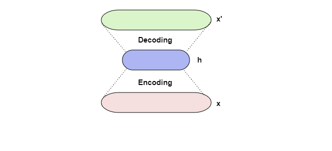
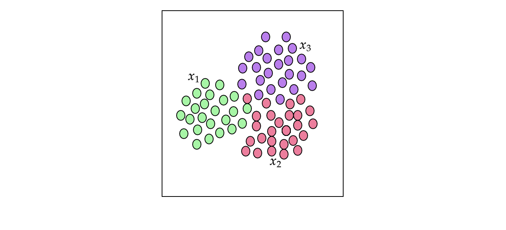
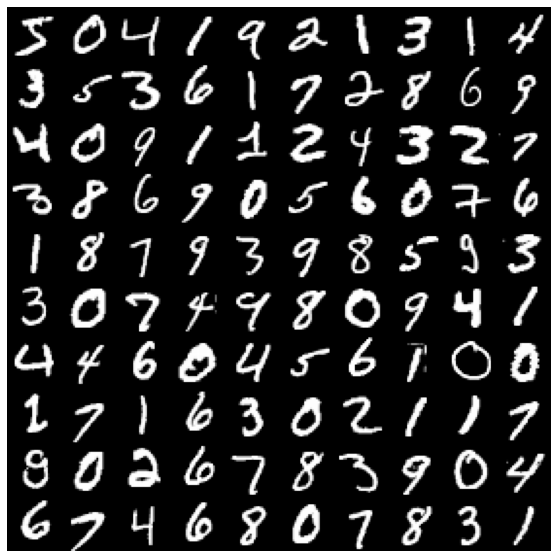
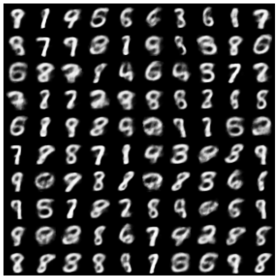

As we know, deep learning has been the most evolving area in Artificial intelligence since the last decade due to research advancements in this area. However, generative modeling is a specific field in Deep Learning that has been a topic of interest for the last few years after discovering GANs. 

<!--more-->

In this article, we will be looking forward to the concept of generative modeling from scratch and understanding its significance. Also, we will understand variational autoencoder with implementation and GANs, which are two of the most famous techniques for generative modeling.


**Table of content**
- [Prerequisites](#prerequisites)
- [Key takeaways](#key-takeaways)
- [Introduction](#introduction)
  - [What is generative modeling](#what-is-generative-modeling)
  - [Example](#example)
- [Discriminative and generative modeling](#discriminative-and-generative-modeling)
- [Why generative modeling?](#why-generative-modeling)
- [Variational Autoencoders](#variational-autoencoders)
  - [Introduction](#introduction-1)
  - [Implementation](#implementation)
- [GAN](#gan)
- [Conclusion](#conclusion)

### Prerequisites

Although I have tried to keep this blog as self-contained as possible, basic prior knowledge of probability and machine learning is still required. Therefore, [here](https://www.analyticsvidhya.com/blog/2017/09/6-probability-distributions-data-science/) is an excellent blog on the probability distribution that readers can refer to before reading the article. 

### Key takeaways

After finishing this blog, readers will understand what a generative model is and how it works. Additionally, the reader will also note the differences between generative and discriminative models and their impact on the future of AI.

### Introduction

Before we dig deeper, I will present a basic notion of generative modeling by taking an example. Supposing we want to classify an image as a dog or a cat. We can solve this problem simply by feeding the image as an input to a convolutional neural network that can output the image's corresponding category. What if we want this process to be reversed? We describe what we want as an input to the model and get the image as output. This is generative modeling in its simplest and most informal form.

Most machine learning practitioners are exposed to the classification or the regression tasks in machine learning first due to its extensive scope and straightforward approach. However, the topic we will cover is not widely known amongst machine learning practitioners. So let's dive deep into the concepts of generative modeling and understand how it can affect the future of machine learning.

#### What is generative modeling

Before we start, let's get into the formal definition of generative modeling:

>Generative modeling is an unsupervised form of machine learning where the model learns to discover the patterns in input data. Using this knowledge, the model can generate new data on its own, which is relatable to the original training dataset.

To understand it a bit more formally, let $x$ be the actual data sample. We will take a particular prescription $z$ using which we will try to generate a sample $x^\*$. Ideally, this generated sample $x^\*$ would look like one from the actual sample $x$. The prescription $z$ is called a learned representation of $x$, present in a latent space and acts as an inspiration. Therefore, the $x^\*$ is different every time. Different models will have different $z$ for the same dataset.

#### Example

Let's try to understand generative models by taking a real-life example. Consider a scenario where you get appointed as a machine learning engineer in your dream company. Now, you give this excellent news to your parents, and they ask you what an ML engineer is and what a day in your job looks like? 

Let us take your information about an ML engineer as $x$. To help someone understand who has never studied ML in their life, you have to give some basic information only because too much of the technicalities will be of no use. Now you explain your job to parents in leman terms, let the information they learnt as $z$(hidden representation of actual information $x$). Now using this $z$ as an inspiration, they will draw a picture in their mind of what an ML engineer does, $x^*$. 

Now ideally, you want $x^*$ to be almost the same as $x$, but it will solely depend on the hidden representation of the $x$. Again, if you have to give the same information to one of your colleagues who knows ML, the $z$ will be different, and the $x^*$ will be closer to the $x$. The same applies to generative modeling. Different models will learn different hidden representations $z$ of original data, and the generated data becomes unique. 

### Discriminative and generative modeling

Machine learning models can broadly be categorized into two categories, discriminative and generative models. Before comparing both of them, let's talk about the discriminative models. In simple terms, as its name suggests, the discriminative model aims to discriminate between multiple data instances. It takes input data for training and makes predictions for the unseen data. Most of the classification and regression techniques fall under this category.
To understand it mathematically, let's take an example of a set of data instances $X$ and a corresponding set of labels $Y$.


[Image source](https://www.analyticsvidhya.com/blog/2021/07/deep-understanding-of-discriminative-and-generative-models-in-machine-learning/)

The discriminative model aims to capture $p(Y|X)$, that is, the conditional probability of $Y$ given $X$. In contrast, the generative model aims to capture joint probability $p(X, Y)$, or just $p(X)$ if there is no $Y$ present. 

### Why generative modeling?

>*The future of AI is generative, not discriminative.*
> 
> Steve Omohundro, Research Scientist at Facebook 

There have been many recent advancements in the field of generative modeling since the last decade. However, still, a lot of research is going on this topic. This section will discuss why generating data is essential and how it can transform the future of machine learning by taking a few interesting use-cases.

The most trending topic in generative modeling is GAN. Yann LeCun, Chief AI Scientist, Facebook, even described GANs as "the most interesting idea  in the last 10 years in Machine Learning". We will talk more about GAN in the next section. For now, let's stick to its applications. GANs have transformed the world of deep learning and are considered the most remarkable invention in artificial intelligence. GAN never fails to surprise from generating portraits to the whole new virtual world. [Here](https://www.cnet.com/news/ai-made-portrait-sells-at-christies-auction-for-432500/) is one such exciting story of GANs. In 2018, a French art collective named Obvious used GAN to generate a portrait sold for half a million dollars. 


[Image Source](https://www.cnet.com/news/ai-made-portrait-sells-at-christies-auction-for-432500/)

Imagine what a future would be if one can use generative modeling to make a complete 2-hour movie using existing movies, compose a piece of music, or maybe write a novel. The innovation will match human expertise, which is the end goal of an AI system.

One more important application of generative modeling is data augmentation. Of course, the most crucial aspect for applying any ML technique is training data. Still, there are certain areas where we have a lot of constraints associated with data availability. One such sector is the medical field. There are a lot of applications of machine learning in the medical field, from diagnosing disease to finding its cure. But medical datasets are harder to collect. Here generative modeling plays a vital role in producing synthetic data to enlarge the training dataset. Extending the training dataset by producing the synthetic data is called Data Augmentation. There is much work done in data augmentation using generative modeling. For example, one such work is done by [Maayan Frid-Adar and others](https://arxiv.org/abs/1803.01229) where they used GAN for synthetic image augmentation to increase the existing performance for liver lesion classification.

Now we will cover two famous techniques for generative modeling, variational autoencoder and GAN.

### Variational Autoencoders

#### Introduction

Before we talk about the vae(variational autoencoders), let's first get a basic notion of what an autoencoder is and how it is different from the vae. 

An autoencoder is a type of feed-forward neural network which does the following:
- Encodes the input $x$ into a hidden representation $h$ by performing various operations.
- Decodes the hidden representation again into $x'$.



The $x'$ is a reconstructed version of the original input $x$. The autoencoder aims to minimize a specific loss function to ensure that the $x'$ is close to our original input $x$.

Now, let us take an example of images belonging to three categories, say, $x_1$, $x_2$ and $x_3$, and we have trained an autoencoder on these examples. Let us assume latent representation has two dimensions, and its distribution looks like this.



Notice that these latent vectors have formed clusters according to their categories. And from here starts the role of generative modeling. Using one of these latent vectors, one can generate the image belonging to one of the three classes. 

Variational autoencoders or vae provides us probabilistic approach to representing these latent vectors. In a normal autoencoder, we will try to represent each attribute of the latent state by a single variable. In vae, we will try to formulate **probability distribution** for each attribute of latent representation. In vae, we will sample from these latent learned distributions, resulting in new images. Now, when we vary the sampling process randomly among these distributions, we get unique results every time, and hence we use the term **variational** in vae. 

To represent the probability distribution of each class of examples in latent space, we will use $\mu$(mean) and sigma $\sigma$(standard deviation). We will learn $\mu$ and $\sigma$ by backpropagating through the network. The loss function that will drive the learning process is:

vae loss = reconstruction loss + KL divergence loss

I will try to explain the above loss function during the implementation part.
 
In this article, we will also try to implement vae. We will be training our vae on the MNIST dataset to keep it simple. We will be using the tensorflow framework of version 1.x and python programming language.

#### Implementation

We will start with importing the standard libraries.
```python
#Importing essential libraries to be used
import tensorflow as tf

import numpy as np
import matplotlib.pyplot as plt

from tensorflow.keras import layers,datasets,metrics
from tensorflow.keras.models import Model
from tensorflow.keras import backend as K
```
The datasets module from tf.keras provides a few toy datasets, one of which is MNIST. Therefore, we will load the standard MNIST dataset. Further, we will be dividing each pixel value by 255 to scale the pixel values in the range of 0 and 1. By doing this, training the model will be a lot more feasible.

```python
(x_train, y_train), (x_test, y_test) = datasets.mnist.load_data()

x_train = x_train.astype('float32') / 255.
x_test = x_test.astype('float32') / 255.
x_train = x_train.reshape((len(x_train), np.prod(x_train.shape[1:])))
x_test = x_test.reshape((len(x_test), np.prod(x_test.shape[1:])))
```
As vae is a generative model, self-supervised to be specific, we will not need y labels. Moreover, we will also not require x_test and y_test as we will be feeding random noise as an input to generate images once the model is trained. Further, let's visualize the training data using matplotlib.

```python
n=10
figure = np.zeros((28*10, 28*10))
temp=0
for i in range(n):
  for j in range(n):
    data = x_train[temp].reshape(28,28)
    figure[i*28 : (i + 1)*28,
           j*28 : (j + 1)*28] = data
    temp+=1

plt.figure(figsize=(10, 10))
plt.imshow(figure, cmap='Greys_r')
plt.axis('off')
plt.show()
```


Now that we have our data ready, let's define a sample method that we will use for sampling. We give mean and standard deviation as input to this method and get a sample from normal distribution as output. Note that mean and standard deviation are the learnable parameters.

```python
def sample(args):
  mean,std = args
  epsilon = K.random_normal(shape=(K.shape(mean)[0], K.int_shape(mean)[1]))
  return mean + K.exp(std/2)*epsilon
```


Finally, it's time to define the model. Again, we will be using functional API from keras. So, first, we will define the encoder model, then the decoder model, and finally, using these two models, we will define vae. 

The input to the encoder model will be the image. The encoder model, in our case, has one hidden layer of dimension 128. The output layer of the encoder has mean and std deviation, which we will be using a vector of dimension 4 to represent. And, finally, we will use a sample method for sampling with the help of the lambda layer. 

```python
#Encoder model
input_layer = layers.Input(shape=(784,), name='input_layer')
hidden_layer = layers.Dense(128, activation='relu', name='encoding')(input_layer)
latent_mean = layers.Dense(4, name='mean')(hidden_layer) 
latent_std = layers.Dense(4, name='var')(hidden_layer)
latent_sample = layers.Lambda(sample, output_shape=(4,))([latent_mean, latent_std])
  
encoder_model = Model(input_layer, [latent_mean, latent_std, latent_sample], name='encoder_model')
```
Now we will move to the decoder part. Remember, we will feed a sampled vector using $\mu$ and $\sigma$, which have a dimension of 4 as an input to the decoder. Again, the decoder is also a three-layered network with a hidden layer with dimension 128 and an output layer that returns the reconstructed version of the input image as an output. We use sigmoid as an activation function for the final layer because pixel values are between 0 and 1.

```python
#Decoder model
decoder_input = layers.Input(shape=(4, ), name='decoder_input')
decoder_hidden = layers.Dense(128, activation='relu', name='decoding')(decoder_input)
decoder_output = layers.Dense(784, activation='sigmoid', name='decoded_output')(decoder_hidden)

decoder_model = Model(decoder_input, decoder_output, name='decoder_model')
```
Once we have our encoder and decoder models ready, we will define the vae. The vae will take an image as an input and return generated image from the decoder. The decoder takes a sample from the distribution, which is present at the second index of encoder output. 

```python
#VAE model
vae = Model(input_layer, decoder_model(encoder_model(input_layer)[2]))
```
We will define the custom loss function to train the vae model. First, reconstruction loss is binary cross-entropy loss computed using each input image pixel and generated image. It is binary because we have already scaled the images between 0 and 1. The second loss function is KL divergence loss. KL divergence loss gives us a measure of how one probability distribution is different from the other. We aim to maximize the KL divergence loss. Hence we introduce a negative sign before it. Now our total loss function will be the mean of both the losses. And we will aim to minimize this loss function by backpropagating through the vae model.
You can read more about KL divergence loss from [this](https://dibyaghosh.com/blog/probability/kldivergence.html) amazing article.

```python
def vae_loss(x, z_decoded, latent_mean=latent_mean, latent_std=latent_std):
    x = K.flatten(x)
    z_decoded = K.flatten(z_decoded)
    recon_loss = metrics.binary_crossentropy(x, z_decoded)
    kl_loss = -1e-4 * K.mean(1 + latent_std - K.square(latent_mean) - K.exp(latent_std), axis=-1)
    return K.mean(recon_loss + kl_loss)
```
Now, as an optimizer, I am going to use rmsprop. But, of course, you are free to experiment with other optimizers as well.

```python
vae.compile(optimizer='rmsprop', loss=vae_loss)
vae.summary()
```


Finally, we are ready to train our model.

```python
vae.fit(x_train, x_train,
        shuffle=True,
        epochs=50,
        batch_size=100)
```
Once the training is finished, we are ready to generate the data. First, we will take a random vector of 4 dimensions over the normal distribution and feed it to the decoder model. Here I am plotting 100 such images using the matplotlib library.

```python
n=10
data = np.random.normal(size=(n*n,4))
figure = np.zeros((28*10, 28*10))
temp=0
for i in range(n):
  for j in range(n):
    generated_data = decoder_model.predict(np.expand_dims(data[temp],axis=0))
    generated_data = generated_data.reshape(28,28)
    figure[i*28 : (i + 1)*28,
           j*28 : (j + 1)*28] = generated_data
    temp+=1

plt.figure(figsize=(10, 10))
plt.imshow(figure, cmap='Greys_r')
plt.axis('off')
plt.show()
```


### GAN

GANs are the class of ML techniques consisting of two simultaneously trained neural networks. One is the generator used to generate the fake data. The other is the discriminator, which is used to classify whether the input is real (image from training dataset) or fake (generated by the discriminator).

The word **adversarial** points to the competitive dynamic between the generator and the discriminator where the generator tries to fool the discriminator by passing fake data. The discriminator's job is to detect the fake data generated by the generator. To understand this, let's imagine a scenario where a thief tries to steal a painting from a museum by replacing it with a fake painting, whereas there will be a curator whose job will be to detect whether the painting is real or fake. In this example, our thief is the generator, and the curator is the discriminator.

Now let's take a look at the architecture of GAN.


We provide random noise input to our generator, transforming the noise into a data sample. The generated data then acts as an input to the discriminator model. The discriminator model also takes real data samples as input, and its job is to classify the input as fake generated data or real data samples. In this way, we frame two loss functions, one is discriminator loss, and the other is generator loss. The discriminator loss is a classification error, and it is back-propagated through the discriminator network. In contrast, the generator loss is an error of classifying the fake generated data as real data, and it is back-propagated through the generator network. This way, two neural networks are being trained simultaneously in an adversarial manner. 

The GAN's convergence is when the discriminator cannot classify between real and fake generated data, which means the probability of classification becomes $0.5$. This point of convergence is known as **Nash Equilibrium**. You can read more about the training of GANs from this excellent [article](https://developers.google.com/machine-learning/gan) by Google Developers.

### Conclusion
We have seen how innovative a generative model can be in this blog. However, we will need AI systems to manage such innovation to deal with the changing environment. For that, old discriminative models trained on a large amount of hand-labelled data for a fixed environment will fail. Therefore, we need generative models in future to respond to that rapidly changing social environment. Moreover, in the future, the generative models will empathize and co-create with humans, which will prove to be a stimulating environment for people to live in.

---
Peer Review Contributions by: [Lalithnarayan C](/engineering-education/authors/lalithnarayan-c/)

<!-- MathJax script -->
<script type="text/javascript" async
    src="https://cdnjs.cloudflare.com/ajax/libs/mathjax/2.7.1/MathJax.js?config=TeX-AMS-MML_HTMLorMML">
    MathJax.Hub.Config({
    tex2jax: {
      inlineMath: [['$','$'], ['\\(','\\)']],
      displayMath: [['$$','$$']],
      processEscapes: true,
      processEnvironments: true,
      skipTags: ['script', 'noscript', 'style', 'textarea', 'pre'],
      TeX: { equationNumbers: { autoNumber: "AMS" },
           extensions: ["AMSmath.js", "AMSsymbols.js"] }
    }
    });
    MathJax.Hub.Queue(function() {
      // Fix <code> tags after MathJax finishes running. This is a
      // hack to overcome a shortcoming of Markdown. Discussion at
      // https://github.com/mojombo/jekyll/issues/199
      var all = MathJax.Hub.getAllJax(), i;
      for(i = 0; i < all.length; i += 1) {
          all[i].SourceElement().parentNode.className += ' has-jax';
      }
    });
    MathJax.Hub.Config({
    // Autonumbering by mathjax
    TeX: { equationNumbers: { autoNumber: "AMS" } }
    });
  </script>
