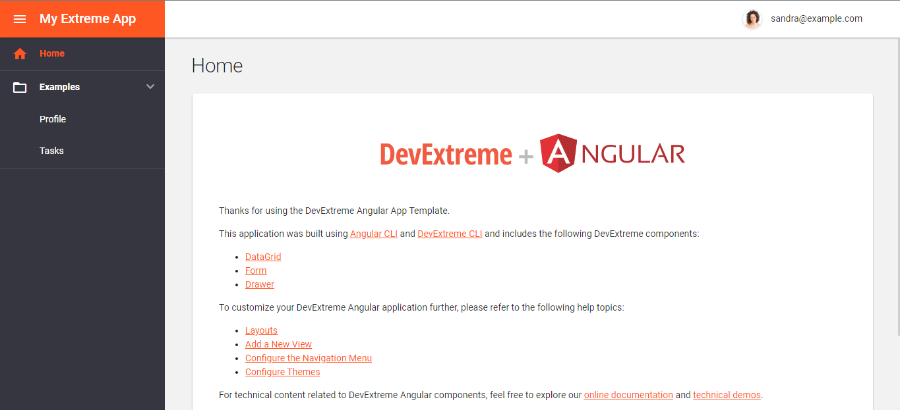

Building Web applications from scratch as a Web developer can be painful and time-consuming. As web developers, we want to build fast and responsive web applications. We are always implementing the same UI components (ex. authentication, headers, user menu, footer, navigation, etc) in every project so why start over and over again. DevExtreme is here to take all the pain away. Devextreme is one of the [DevExpress](https://www.devexpress.com/) components. It includes a collection of high-performance and responsive UI widgets which can be used to build both mobile and web applications.

DevExtreme mainly works with the Javascript frameworks: Angular, React jQuery, and Vue. It can also be used with technologies like ASP.NET MVC, Knockout, and ASP.NET Core. It is fast and easy to use because of its ready-built responsive UI components. These include interactive charts, Data editors, drop-down boxes, and much more. DevExtreme can also be added to existing applications. For futher studies [read More](https://js.devexpress.com/)

### Prerequisites
To understand this article basic knowledge of the following is required:
- JavaScript frameworks (React, Angular, Vue, and jQuery).
- App templating.
- Visual Studio Code/Visual Studio (Recommended)

### When to use Devextreme
DevExtreme is recommended when building a CRM system or robust application. Otherwise, it's not a good choice when building simple websites or apps due to the heavy bundled template size. 

### DevExtreme UI components
DevExtreme has several ready-built, interactive UI components for you to build your next application easily. These include data tables, charts, data reporting tools, autocomplete, file managers, file uploader buttons, boxes, accordions, etc. With all these ready-built components, building applications are very easy, fast, and fun using DevExtreme. For futher studies [read more](https://js.devexpress.com/Documentation/Guide/UI_Components/).

I recommend you try to use DevExtreme with your favorite Javascript framework so you can make use of these awesome reactive components.

### Download DexExpress
To finally use Devextreme you have to download [DevExpress](https://www.devexpress.com/) because it's one of the Devexpress components. You can find the link to download it [here](https://js.devexpress.com/Download/)

> DevExpress is not free, but to start, you can use the free trial version.

### Requirements for DevExtreme
- Node.js v12.6.0 or later
- npm v6.2.0 or later

### DevExtreme CLI installation
Run the command in your terminal.
1. Run `npm i -g devextreme-cli` (Note: This command will install the CLI Globally. Alternatively execute this command with [npx](https://www.npmjs.com/) to call the CLI command without global installation)

### Creating a DevExtreme application
The way we create Devextreme applications is quite different depending on the javascript framework we are using (React.js, Angular, or Vue.js).

> To fully understand this lesson you must be familiar with the basic concept and patterns of the framework you want to use. For beginners, I suggest you use the free trial first so you get yourself familiar with DevExteme and its components.

#### For React applications
 1. ```npx -p devextreme-cli devextreme new react-app application-name```
 2. ```cd application name```
 3. ```npm run start```

- [Documentation](https://js.devexpress.com/Documentation/Guide/React_Components/Create_a_DevExtreme_Application/)

#### For Angular applications
 1. ```npx -p devextreme-cli devextreme new angular-app application-name```
 2. ```cd application name```
 3. ```npm run start```

- [Documentation](https://js.devexpress.com/Documentation/Guide/Angular_Components/Getting_Started/Create_a_DevExtreme_Application/)

#### For Vue applications
 1. ```npx -p devextreme-cli devextreme new vue-app application-name```
 2. ```cd application name```
 3. ```npm run start```
- [Documentation](https://js.devexpress.com/Documentation/Guide/Vue_Components/Create_a_DevExtreme_Application/)

### Building an Angular DevExtreme 
For the demonstration purpose in this tutorial I will create a DevExtreme application using my favorite JS framework Angular.

- To create my Angular app, firstly I have to run:
```
npx -p devextreme-cli devextreme new angular-app my-extreme-app
```
- After the installation, I have to cd into the project:
```
cd my-extreme-app
```
- to start my application:
```
npm run start
```
To view your DevExtreme template, DevExtreme runs on default port 4200 which corresponds to the URL: http://localhost:4200. Visit that URL on your favorite browser after running the application. Always remember to go through the `ReadMe` file before starting the application in case of any change or update. 

> The DevExtreme application template comes with Drawer, Data Grid, and forms Components.

### Default Template View


### DevExtreme ThemeBuilder
Manipulating DevExtreme is really easy. Using the *ThemeBuilder*,  you can customize themes based on the DevExtreme default theme. The link to use the ThemeBuilder can be found [here](https://devexpress.github.io/ThemeBuilder/).

 To configure the template theme open `src\themes\metadata.additional.json` and `src\themes\metadata.base.json`. In the template, edit the theme name in the JSON file. By default, the theme is orange as you can see in the image above. I changed mine to blue in the two JSON files:

```json
{
  "items": [],
  "baseTheme": "material.blue.light",
  "assetsBasePath": "../../../node_modules/devextreme/dist/css/",
  "outputColorScheme": "base",
  "base": true
}
```

```json
{
 {
  "items": [],
  "baseTheme": "material.blue.dark",
  "assetsBasePath": "../../../node_modules/devextreme/dist/css/",
  "outputColorScheme": "additional",
  "makeSwatch": true,
  "base": true,
  "widgets": [
    "treeview",
    "navbar"
  ]
}
}
```


Click [here](https://js.devexpress.com/Documentation/Guide/Themes_and_Styles/Predefined_Themes/) to view the DevExtreme predefined themes using material design themes and generic compact.

### Conclusion
DevExtreme is one of DevExpress' components that works with Javascript frameworks (React, Angular, Vue, and jQuery) to build fast responsive web or mobile applications. It has a lot of ready-built UI Components and other awesome features. DevExtreme is fast easy to use and well documented. I suggest you read more about DevExpress [here](https://docs.devexpress.com/).

### Further reading
[DevExpress Documentation](https://docs.devexpress.com/)
[The DevExtreme Documentation](https://js.devexpress.com/Overview/)

