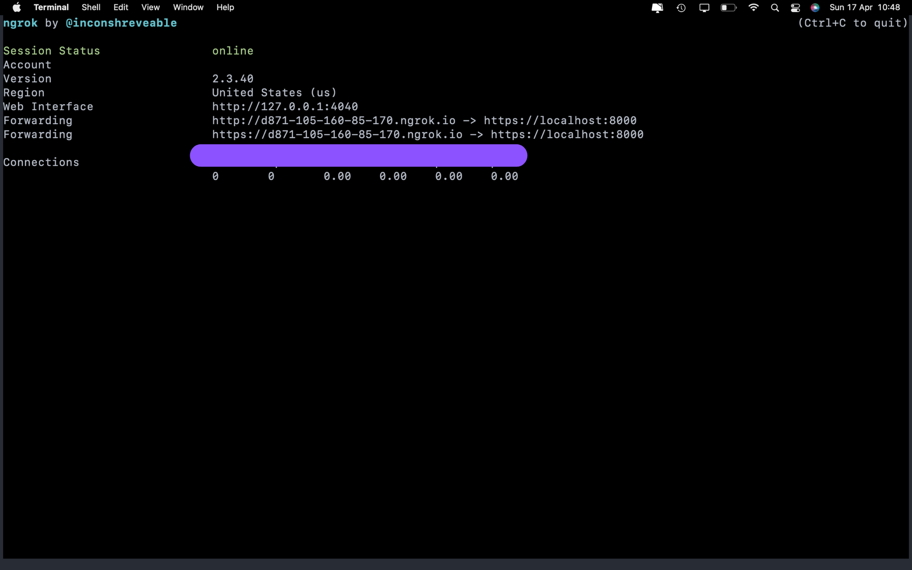
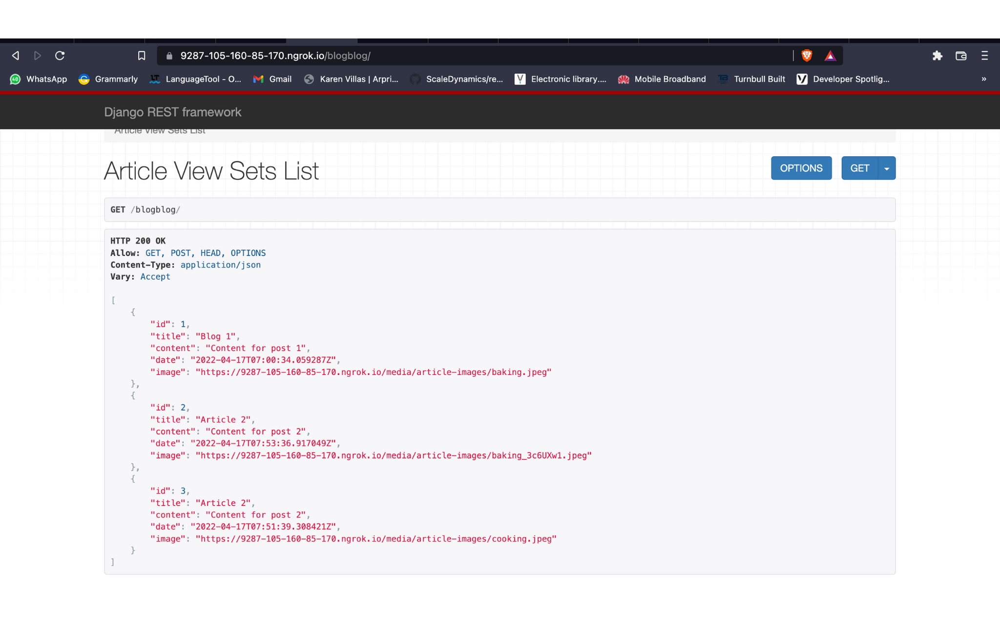

Developing application locally is fast and reliable in terms of response time and debugging processes as it does not need an internet connection. However, it comes with some challenges though. 
<!--more-->
For instance, let us say you want to build an API that uploads images to a server and an android application that consumes your API  on a mobile phone with your computer as a server. Then, it is efficient to use Ngrok to expose the endpoints.

When the images are uploaded to a static file folder in your application, the application constructs a static URL that can be used to access the images automatically. However, the URL appears in the format `http://localhost/media.imagename.png`, but the android studio cannot work with `HTTP` resources. So instead, it uses `HTTPS` resources.

This tutorial aims at going around this problem by creating a self-signed certificate and making our site a trusted source so that when Ngrok exposes our endpoint to the public, our images appear as they have come to form a trusted source.

We will build a Django Posts API and test the scenarios using REST frameworks browsable API.

### Prerequisites
- A good understanding of [Django.](https://www.djangoproject.com/)
- Knowledge of [Python programming.](https://www.python.org/)
- Working with [REST Framework](https://www.django-rest-framework.org/).
- A code editor, most preferably [VS Code](https://code.visualstudio.com/) or Pycharm

### Getting Started
To get started, create a virtual environment and install Django. Django is a Python framework for building scalable applications.


```bash
pip install Django 
```

Next, execute the following command in your terminal to create a Django project.

```bash
Django-admin startproject posts-config
```

The command above creates a folder that mainly contains the configurations for the Django application. That is why I called it `posts-config`.

### Setting the REST framework
The next step is to start a new app called `blog`. This application will contain the `models`, `URLs`, `serializers` and `views` seen in the browsable API provided by the REST framework. However, first, execute the command below to install the REST framework.

```bash
pip install djangorestframework
```

We need to add the installed REST framework to the list of installed apps in the `settings.py` file. In the `posts-config` folder, open the `settings.py` file, then add the following snippets.

```py
INSTALLED_APPS = [

    "rest_framework",
]
```

### Models, Serializers, Views and URLs
Any Django REST API application comprises three main components: models, views, and URLs. In this section, we will discuss each of the components.

Run the following command to start a new application called blog.

```bash
python manage.py startapp blog
```

Then, add the newly created app to the list of installed applications.

```py
INSTALLED_APPS = [
    'rest_framework',
    'blog'
]
```


#### Models
Models are like data classes that specify how the data is stored in the database. For example, they specify fields in a record regarding data type and space it occupies in memory.

Add the following code snippets in the models.py file created in the blog folder.

```py
class Article(models.Model):
    title = models.CharField(max_length=20)
    content = models.CharField(max_length=255)
    date = models.DateTimeField(auto_now=True)
    image = models.ImageField(upload_to="article-images/", null=True)

    def __str__(self):
        return self.title
```
#### Serializers
Create a file called `serializers.py` in the same folder as `models.py`. This file contains the logic for converting the data classes to JSON that other applications can consume

In the `serializers.py` file, add the following code snippets:

```py
from rest_framework import serializers
from blog.models import Article

class ArticleSerializers(serializers.ModelSerializer):
    class Meta:
        model = Article
        fields = "__all__"
```

#### Views
In the views.py file, add the following snippets to specify the function to be run when a URL is accessed.

```py
from rest_framework import viewsets

from .models import Article
from .serializers import ArticleSerializers


class ArticleViewSets(viewsets.ModelViewSet):
    queryset = Article.objects.all()
    serializer_class = ArticleSerializers
```

#### URLs
The URLs specify the actual route to visit to access a resource. For example, we will have two URLs; the first will occur in the main application folder called `blogconfig` while the second will occur in the `blog` folder.

In the `blogconfig` folder, add the following snippets:

```py
from django.contrib import admin
from django.URLs import path, include

urlpatterns = [
    path("admin/", admin.site.urls), 
    path("blog", include("blog.urls"))
]
```

Proceed to the application level, create a new file called `urls.py`, and add the following snippets.

```py
from django.URLs import path, include
from rest_framework import routers

from .views import ArticleViewSets

router = routers.DefaultRouter()
router.register(r"blog", ArticleViewSets)

urlpatterns = [
    path("", include(router.urls)),
]
```

### Setting up media URL
In this section, we will set our media URL so that the application can reconstruct a URL for a single article media file.

In the setting.py file, add the following snippet.


```py
MEDIA_URL = "/media/"
MEDIA_ROOT = os.path.join(BASE_DIR, "media")
```

Next, join the media path with the main URL in the project level urls.py file as shown below:

```py
from django.conf.urls.static import static
from django.contrib import admin
from django.URLs import path, include

from blogconfig import settings

urlpatterns = [
    path("admin/", admin.site.urls),
    path("blog", include("blog.urls"))
] + static(settings.MEDIA_URL, document_root=settings.MEDIA_ROOT)

```

Next, run the following command in the terminal to make migrations and create tables in the database.

```bash
python manage.py makemigrations && python manage.py migrate
```

Right now, if we navigate to the `http://127.0.0.1:8000/blogblog/`, we can create a post as shown below:

```bash
{
    "id": 1,
    "title": "Blog 1",
    "content": "Content for post 1",
    "date": "2022-04-17T07:00:34.059287Z",
    "image": "http://127.0.0.1:8000/media/article-images/baking.jpeg"
}

```


However, the post image URL is not secure. We need to make sure that our images are secure so that we have something of this sort:

```bash
{
    "image": "https://127.0.0.1:8000/media/article-images/baking.jpeg"
}
```

### Generating a self-signed certificate
To generate a self-signed SLL certificate, run the following command in the terminal.

```bash
brew install mkcert
```

Usually, when certificates are issued, they are issued by an entity called Certificate Authority. Therefore, we need to install a local certificate Authority in our machines for our case. Run the command below to install a local CA.

```bash
mkcert -install
```

Now we need to generate the certificate for our local application. In the root folder of the application, run the following command.

```bash
mkcert -cert-file cert.pem -key-file key.pem localhost 127.0.0.1
```

Next, we need to set up Django to run with the HTTPS server. First, execute the command below, then add the `sslserver` to the installed apps list.

```bash
pip install django-sslserver
```

The above configurations enabled us to transform our URLs from `HTTP` to `HTTPS` such that when we expose the image URLs, they will appear as secured using our locally signed certificate.

### Exposing the secured endpoints with Ngrok
Ngrok is an application that quickly exposes the local server port to the internet. It enables application resources to be accessed by the whole internet.

To install Ngrok, run the command below:

```bash
brew install ngrok/ngrok/ngrok
```

If you use Windows or Linux, follow [this link](https://ngrok.com/download) for the installation procedure.

Next, start the development server using the command below:

```bash
python manage.py runsslserver
```

Next, head over to the Ngrok terminal and expose the running server using the command:

```bash
ngrok http https://localhost:8000
```

This command will generate a URL on the terminal that will be secured when pasted on the browser. However, it would be best to allow either connection from all hosts or the specific URL generated by ngrok.



Open the settings.py file, add the url or use `*` to allow connections from all hosts in the ALLOWED_HOSTS section.

```py
ALLOWED_HOSTS = ['*']
```

The images are rendered as secure if we head over to the browser, as shown below. If this API were to be consumed by a mobile application, Android studio would not complain of the insecure resources.



### Conclsuion
We wrote a Django REST API using the Django REST framework in this article. First, we tested our API locally and later exposed it using Ngrok. Next, we installed a custom Certificate Authority in our local machines and then generated a self-signed certificate to secure our localhost endpoints. Lastly, we tested the secured endpoints to see if they were secured.  
