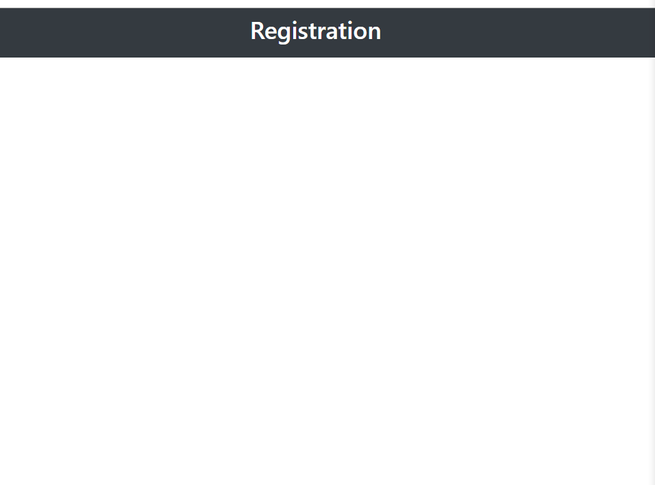
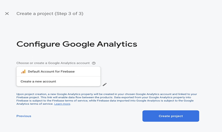
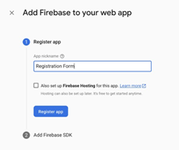
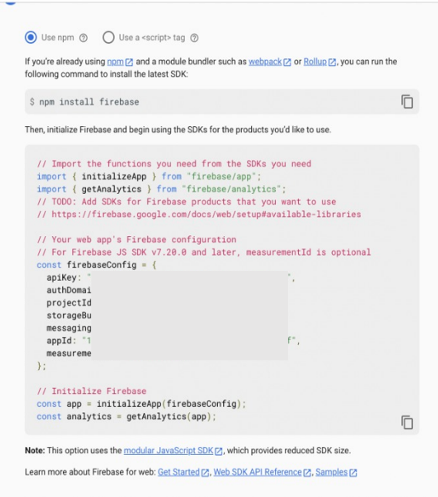

### Create a registration form using React.js ( Hooks )

We will make a registration form using React.js and connect it with firebase from scratch using react hooks, bootstrap and Firebase In the end, you will have the form ready


So now let's start with setting up our coding environment
* node.js should be installed and any code editor you like to use.
* Optionally you can also install the Yarn package manager.
* Now we have everything ready, so open your terminal and run the below commands to create your react app

```
npx create-react-app loginforms
cd loginforms
npm start
```


If your setup is complete you will get to see the below screen:-


This is a boilerplate code that comes when we create a react app. Now open the login form folder and open index.html in the `public` folder add bootstrap scripts there, here are the CDN links:-

``` html
<!DOCTYPE html>
<html lang="en">
  <head>
    <meta charset="utf-8" />
    <link rel="icon" href="%PUBLIC_URL%/favicon.ico" />
    <meta name="viewport" content="width=device-width, initial-scale=1" />
    <meta name="theme-color" content="#000000" />
    <meta
      name="description"
      content="Web site created using create-react-app"
    />
    <link rel="apple-touch-icon" href="%PUBLIC_URL%/logo192.png" />
    <link rel="stylesheet" 
          href="https://maxcdn.bootstrapcdn.com/bootstrap/4.0.0/css/bootstrap.min.css" 
          integrity="sha384-Gn5384xqQ1aoWXA+058RXPxPg6fy4IWvTNh0E263XmFcJlSAwiGgFAW/dAiS6JXm" 
          crossorigin="anonymous">
   
    <link rel="manifest" href="%PUBLIC_URL%/manifest.json" />
    <title>React App</title>
  </head>
  <body>
    <noscript>You need to enable JavaScript to run this app.</noscript>
    <div id="root"></div>
    <script src="https://code.jquery.com/jquery-3.2.1.slim.min.js" integrity="sha384-KJ3o2DKtIkvYIK3UENzmM7KCkRr/rE9/Qpg6aAZGJwFDMVNA/GpGFF93hXpG5KkN" crossorigin="anonymous"></script>
    <script src="https://cdnjs.cloudflare.com/ajax/libs/popper.js/1.12.9/umd/popper.min.js" integrity="sha384-ApNbgh9B+Y1QKtv3Rn7W3mgPxhU9K/ScQsAP7hUibX39j7fakFPskvXusvfa0b4Q" crossorigin="anonymous"></script>
    <script src="https://maxcdn.bootstrapcdn.com/bootstrap/4.0.0/js/bootstrap.min.js" integrity="sha384-JZR6Spejh4U02d8jOt6vLEHfe/JQGiRRSQQxSfFWpi1MquVdAyjUar5+76PVCmYl" crossorigin="anonymous"></script>
  </body>
</html>

  </body>
</html>
```


This is where our code start you can change the meta tags as per your requirements.

Now go inside the src folder there you will find `app.js` that's where we start our code. In react we write JSX for writing our HTML code. Create a new folder named components inside the src folder. Here we will make all of our components and then render them in App.js.

Now let's first create navbar components for our header. The code of the header component is as follows:-

``` javascript
import React from 'react';
function Header() {
    return(
        <nav class="bg-dark navbar-dark navbar">
            <div className="row col-12 d-flex justify-content-center text-white">
                <h3>Registration</h3>
            </div>
        </nav>
    )
}
export default Header;
```

since our main code runs from `app.js` we need to import our Header component in it. Modify your `app, js` as follows:

```javascript
import logo from './logo.svg';
import './App.css';
import Header from './components/header';

function App() {
  return (
    <div className="App">
      <Header/>
    </div>
  );
}

export default App;
```

If you have written the above code correctly the webpage will look like this:

;

Next, we have to add a registration form for the users. Create a RegistrationForm folder inside the components folder and add the code to create the input elements.
For styling make a `style.css` file inside the component folder here we will write all our styles and include them in your registration form component.

``` javascript
import React, {useState} from 'react';
import './style.css'
function RegistrationForm() {
    return(
      <div className="form">
          <div className="form-body">
              <div className="username">
                  <label className="form__label" for="firstName">First Name </label>
                  <input className="form__input" type="text" id="firstName" placeholder="First Name"/>
              </div>
              <div className="lastname">
                  <label className="form__label" for="lastName">Last Name </label>
                  <input  type="text" name="" id="lastName"  className="form__input"placeholder="LastName"/>
              </div>
              <div className="email">
                  <label className="form__label" for="email">Email </label>
                  <input  type="email" id="email" className="form__input" placeholder="Email"/>
              </div>
              <div className="password">
                  <label className="form__label" for="password">Password </label>
                  <input className="form__input" type="password"  id="password" placeholder="Password"/>
              </div>
              <div className="confirm-password">
                  <label className="form__label" for="confirmPassword">Confirm Password </label>
                  <input className="form__input" type="password" id="confirmPassword" placeholder="Confirm Password"/>
              </div>
          </div>
          <div class="footer">
              <button type="submit" class="btn">Register</button>
          </div>
      </div>      
    )       
}
export default RegistrationForm;
```
This is your code of `style.css`  file
```css
body{
    background: #bdc3c7;  /* fallback for old browsers */
    background: -webkit-linear-gradient(to right, #2c3e50, #bdc3c7);  /* Chrome 10-25, Safari 5.1-6 */
    background: linear-gradient(to right, #2c3e50, #bdc3c7); /* W3C, IE 10+/ Edge, Firefox 16+, Chrome 26+, Opera 12+, Safari 7+ */
}

.form{
    background-color: white;
    border-radius: 5px;
    width: 550px;
    margin: 20px auto;
    padding: 20px;
    /* height: 600px; */
}

.form-body{
    text-align: left;
    padding: 20px 10px;
}

.form-body > *{
    padding: 5px;
}

.form__label{
    width: 40%;
}

.form_input{
    width: 60%;
}

.footer{
    text-align: center;
}


```

Make sure to include this component in  `App.js` 

``` javascript
import logo from './logo.svg';
import './App.css';
import Header from './components/header';
import RegistrationForm from './components/registrationForm'

function App() {
  return (
    <div className="App">
      <Header/>
      <RegistrationForm/>
    </div>
  );
}

export default App;
```

I recommend you first go through react official documentation. Let's have an overview of hooks in react.js
`useState` hook is used to maintain a state of a variable which we can update dynamically using `setState` 

Now let's get to our form we need to maintain the state of every input in our form so that when users hit submit we can send the data to our backend API. If you remember in javascript we used to update this using `document.getElementById("demo").value` but in react we have a state for every input and we will update it on every Onchange event. 

import `useState` and `setState` hooks form react on top of your code.Now we make a state for all input element. 
```jsx
    const [firstName, setFirstName] = useState(null);
    const [lastName, setLastName] = useState(null);
    const [email, setEmail] = useState(null);
    const [password,setPassword] = useState(null);
    const [confirmPassword,setConfirmPassword] = useState(null);
```

We have to update these value on onChange of every input in the form ans value in the input tag now will be displayed using value tag inside input. So now input tags format will be like this 
```javascript
<input className="form__input" type="text" value={firstName} onChange = {(e) => handleInputChange(e)} id="firstName" placeholder="First Name"/> 
<input  type="text" name="" id="lastName" value={lastName}  className="form__input" onChange = {(e) => handleInputChange(e)} placeholder="LastName"/>
<input  type="email" id="email" className="form__input" value={email} onChange = {(e) => handleInputChange(e)} placeholder="Email"/>
<input className="form__input" type="password"  id="password" value={password} onChange = {(e) => handleInputChange(e)} placeholder="Password"/>
<input className="form__input" type="password" id="confirmPassword" value={confirmPassword} onChange = {(e) => handleInputChange(e)} placeholder="Confirm Password"/>
```
inside the onChange event we have called a function handleInputChange and passed event i.e e inside it here will handle state update of all the input change.So function will be this:-
```javascript
 const handleInputChange = (e) => {
        const {id , value} = e.target;
        if(id === "firstName"){
            setFirstName(value);
        }
        if(id === "lastName"){
            setLastName(value);
        }
        if(id === "email"){
            setEmail(value);
        }
        if(id === "password"){
            setPassword(value);
        }
        if(id === "confirmPassword"){
            setConfirmPassword(value);
        }

    }
```

In this function, we get the id and the value entered inside the input box as soon as we type anything there we update the state of that particular field. This is how we maintain all the states so on submit button we can send all the required information to our backend APIs.

I have made a handle submit function in which we are getting all the values that are filled in the form. We can use these values however you need to send to the backend or display something 

here is your how final `registrationForm.js` will come as 
```java script
import React, {useState,setState} from 'react';
import './style.css'
function RegistrationForm() {
    
    const [firstName, setFirstName] = useState(null);
    const [lastName, setLastName] = useState(null);
    const [email, setEmail] = useState(null);
    const [password,setPassword] = useState(null);
    const [confirmPassword,setConfirmPassword] = useState(null);

    const handleInputChange = (e) => {
        const {id , value} = e.target;
        if(id === "firstName"){
            setFirstName(value);
        }
        if(id === "lastName"){
            setLastName(value);
        }
        if(id === "email"){
            setEmail(value);
        }
        if(id === "password"){
            setPassword(value);
        }
        if(id === "confirmPassword"){
            setConfirmPassword(value);
        }

    }

    const handleSubmit  = () => {
        console.log(firstName,lastName,email,password,confirmPassword);
    }

    return(
        <div className="form">
            <div className="form-body">
                <div className="username">
                    <label className="form__label" for="firstName">First Name </label>
                    <input className="form__input" type="text" value={firstName} onChange = {(e) => handleInputChange(e)} id="firstName" placeholder="First Name"/>
                </div>
                <div className="lastname">
                    <label className="form__label" for="lastName">Last Name </label>
                    <input  type="text" name="" id="lastName" value={lastName}  className="form__input" onChange = {(e) => handleInputChange(e)} placeholder="LastName"/>
                </div>
                <div className="email">
                    <label className="form__label" for="email">Email </label>
                    <input  type="email" id="email" className="form__input" value={email} onChange = {(e) => handleInputChange(e)} placeholder="Email"/>
                </div>
                <div className="password">
                    <label className="form__label" for="password">Password </label>
                    <input className="form__input" type="password"  id="password" value={password} onChange = {(e) => handleInputChange(e)} placeholder="Password"/>
                </div>
                <div className="confirm-password">
                    <label className="form__label" for="confirmPassword">Confirm Password </label>
                    <input className="form__input" type="password" id="confirmPassword" value={confirmPassword} onChange = {(e) => handleInputChange(e)} placeholder="Confirm Password"/>
                </div>
            </div>
            <div class="footer">
                <button onClick={()=>handleSubmit()} type="submit" class="btn">Register</button>
            </div>
        </div>
       
    )       
}

export default RegistrationForm
```

Here is the link to find the full code of this registration form 
[link](https://replit.com/@AnubhavBansal1/Registration-Form-1#README.md)


Our Registration from is completed but we need to store the information registered by the user, for that we will use fire base.


Good news! Guys for using fire base we don't need to install any app just need Google/Gmail mail id. We all do have that I'd right?

Now we will start learning how to connect fire base to our Registration from. For that we need to do the following.

- At first what we required? We required a space where we can record our data. For that we will go to firebase homepage [Click here.](https://firebase.google.com/) Or Type firebase.google.com
 Homepage will appear 


Then, Click on the Get Started button 

- We will start our project. Click on Add project. 
 
 
 
 - Give the preferable name to the project. We have taken Registration-Form. 
  


Then click on continue. 

-  Next step will appear click on continue then after that we need to choose Default Account for Firebase. 
  


Then click on "Create project"

Now our project file is ready we will use it to build real time data base. 

- To make a setup for real-time data we will select "Realtime Database"  form the left panel. 


Then click on the "Create Database" button. The Set up database dialog box will appear 


We will go to next step by leaving the default location. Since we are in developing mode, we will select "Start in test mode" and enable it.

Now our place is ready where real time data is stored.
image of real time data 

We need to create linkage between our react project and real time data base. 
 
- For that we will go to project overview from the left panel and then click on Web button.


- We have to Register our app and give nickname to it. We are giving "Registration Form" or we can choose any name of our choice. Since we are not hosting we will not select the option "set up Firebase hosting for this app" and then click on Register App. 



- We go to our react project there we will connect our real time database. For that we need to type this command into the terminal or we can copy paste it too.
   
`npm install firebase`

- To add the package into your react app we have to install firebase package over there. Now using terminal or command prompt go to the directory where your project is and run this command. 
 


Create a new file with the name "firebase.js" in the Src folder where we will copy the code. 

we have initialize the fire base. Now we will import data base in our code. 
- For importing the data write the following statement

`import { getDatabase } from "firebase/database"`

- In order to use this data base in our registration form component we will use  export statement. Add the following statements in the code.
`export const database = getDatabase(app);`

In the registration form component import the following files

`import {database} from '../firebase'
import {ref,push,child,update} from "firebase/database";`

- To store the input entered by the user we need to add the following code into the handle Submit function we made earlier 

```java script
let obj = {
            firstName : firstName,
            lastName:lastName,
            email:email,
            password:password,
            confirmPassword:confirmPassword,
        }       
        const newPostKey = push(child(ref(database), 'posts')).key;
        const updates = {};
        updates['/' + newPostKey] = obj
        return update(ref(database), updates);
```

Npw we have completed our steps successfully. 

****Now we will see how it work****

We will fill the details in the form then click on register .


When we go to your firebase base account and check your Realtime database the your input is available there as shown in below pic.


Congratulation you have successfully learn how to make registration form and connect it to firebase to store real time data.


