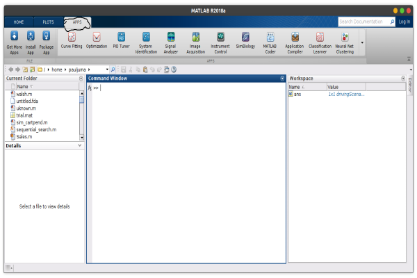
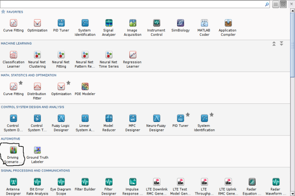
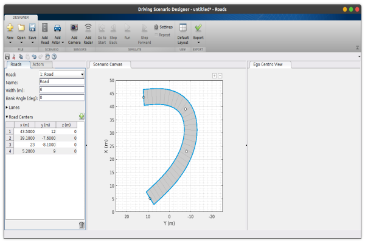
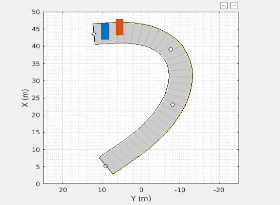
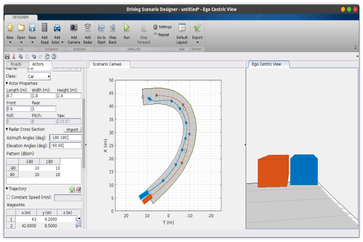
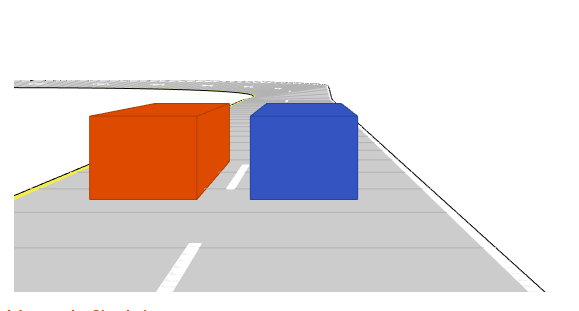

### How to use the driving scenario App to create scenarios in Matlab
### Introduction
The Driving Scenario Designer App is used in designing synthetic driving scenarios. These scenarios are used in testing the automatic driving systems. The tool is mostly applied in developing automatic cars. It is because you can create all the scenarios using this toolbox. These applications include the creation of roads and adding actors into them. Actors are any mobile part of the road. One advantage of this application is that you add these scenarios using a drag and drop interface. Also, you can add radar and sensors to your ego car. The ego car is the car that you are trying to automate while considering the surrounding factors. These sensors can generate the line boundary and maintain your car within the boundary. 
This tutorial will see how to use this App to create scenarios. We will create scenarios directly from the toolbox and programmatically from the command window. All these two different scenario creation requires this toolbox.

### Prerequisites
To follow along with this tutorial, you will need:
- [MATLAB](https://www.mathworks.com/products/get-matlab.html?s_tid=gn_getml) installed.
- Proper understanding of [MATLAB](https://www.section.io/engineering-education/getting-started-with-matlab/) basics.

### Driving scenario
### Why this App
Now, if you want to test the sensor algorithm, traditionally, you had to collect testing data by driving your car over different environments. Then, you would take this data into Matlab for analysis. The whole process of collecting adat is time-consuming and requires quite more energy. The designer App lets you test your algorithm faster. Instead of driving around to collect testing data, you can create scenarios to gather data.
The scenarios created in the designer App can contain all the possible constituents of the road. For example, it may include the road signs, pedestrians, lane boundary and vehicles. Also, you can virtually set up the scenario and simulate the sensor detection.
These variables are then exported in Matlab and test your sensor algorithm. Let us walk through the App to see how to use this App.

The first locate this App in the apps section. You can locate this App in two ways in Matlab. 
- At the top of the Matlab window, click on the App section.



- Click on the dropdown arrow to locate the automotive section.
- In the automotive section, select the `Driving Scenario App`.



- Double-click the App to open it.

Alternatively, you can execute the `drivingScenarioDesigner` command in the command window. This command automatically opens the App. When you open the App, the display will be as shown below:


You can add roads and movable objects known as actors in the driving scenario App. Actors are of different types depending on what you want to carry out. The actors are such as cars, trucks, bicycles and barriers.
When you open this App, you find it is divided into three parts. These three parts are actors/roads, scenario canvas, and egocentric view. The actors/roads section shows the roads' properties or the actors you have added. You use the scenario canvas to add your scenarios. It acts as the working space for the App. Egocentric section where your scenarios appear as a reality. This section makes them appear in a more practical form.

### Adding scenarios to the scenario canvas
We will start by adding a road to our scenario canvas. To add a road, click on the `add road` at the top bar of the App. After this, move the cursor to the scenario canvas. Click at the starting point, the second point, and make a shape you desire and then click `enter`. Example as shown below:


When you click enter, you have:



After adding your road, the road description is given in the road/actor section. For example, our road has four centres and a width of six metres. The centres are the number of endpoints when creating the road.
We can also add actors to our road. The actors that we want to add are vehicles/cars. In adding your cars, you have to specify your ego car. An ego car is a car that is controlled by automated driving systems. By default, the first car you add into the scenario canvas is the ego car. It is possible to change the ego car as per your desire.
To add a car into the scenario canvas, click on the `actors` and select your prefered actor. After that, you drive the cursor to the position you require on the road. 



Since these are automated cars, you have to create a `way point`. A waypoint is a specific lane where the car will follow. When creating a scenario and an actor is involved, you cannot run this program without adding a waypoint. In adding a waypoint, every car has its waypoint. Select the car/ truck that you want to add a waypoint, then right-click on it and select `add way point`. It creates a cursor that enables you to create this waypoint.
After this, you can now run your simulation to see how it works. Again, we see the program run as we want it to run when you run it.



This App allows you to add any property you need for your simulation. Alternatively, you can add these properties programmatically.

### Adding scenarios programatically
You want to add a scenario of two cars ten meters apart. You can specify the vehicle speed. These cars could be moving at constant or different speeds depending on how you want them to be. The first will be moving at a speed of 4m/s and the other 7m/s.
```Matlab
driving = drivingScenario;
vehicle1 = vehicle(driving,'ClassID',1','Position',[6 0 0],'Velocity',[-4 0 0],'Yaw',180)
```
It is the code that adds your first actor. The variable `driving` initializes this toolbox. Next, we use the `vehicle()` function to add a vehicle to your scenario. This function takes the initialization toolbox variables `scenario`, `position`, `velocity` and the `yaw`. `Yaw` is the oscillation about an axis. Now, if you look at the velocity, it is negative. It is because the movement is assumed to be along the y-axis. From the origin, the y-axis values are always negative.
When you execute the code above, we get:
```Matlab
vehicle1 = 

  Vehicle with properties:

               ActorID: 1
               ClassID: 1
              Position: [6 0 0]
              Velocity: [-3 0 0]
                   Yaw: 180
                 Pitch: 0
                  Roll: 0
       AngularVelocity: [0 0 0]
                Length: 4.7000
                 Width: 1.8000
                Height: 1.4000
            RCSPattern: [2×2 double]
      RCSAzimuthAngles: [-180 180]
    RCSElevationAngles: [-90 90]
         FrontOverhang: 0.9000
          RearOverhang: 1
             Wheelbase: 2.8000
```
You can add the second car using the code below:
```matlab
vehicle2 = vehicle(scenario,'ClassID',1,'Position',[0 10 0],'Velocity',[0 -7 0],'Yaw',-90)
```
The output is:
```Matlab
vehicle2 = 

  Vehicle with properties:

               ActorID: 2
               ClassID: 1
              Position: [0 10 0]
              Velocity: [0 -4 0]
                   Yaw: -90
                 Pitch: 0
                  Roll: 0
       AngularVelocity: [0 0 0]
                Length: 4.7000
                 Width: 1.8000
                Height: 1.4000
            RCSPattern: [2×2 double]
      RCSAzimuthAngles: [-180 180]
    RCSElevationAngles: [-90 90]
         FrontOverhang: 0.9000
          RearOverhang: 1
             Wheelbase: 2.8000
```
After creating these scenarios programatically, we can visualize them by ploting them using the `plot()` function as shown below:
```matlab
plot(driving);
set(gcf,'Name','Scenario Plot')
xlim([-20 20]);
ylim([-20 20]);
```
The `set()` function sets properties to your scenario. The `gcf` returns the handle to the current figure since this execution is done in the command window. The output here is:


We can create a relative vehicle placement by using a `chasePlot`. This plot makes the egocentric view of your simulation. This plot displays the projective perspective view from a distance by default. For example, let us show the perspective view of the second car using the `chasePlot` function.
```Matlab
chasePlot(v2)
set(gcf,'Name','Chase Plot')
```
The output is:


This output shows the perspective as it is seen some distance from the second car. The cars are 10m apart with 6m between them from the plot.

### Simulation containing both the ego car and the road
In adding roads, you specify the road centres and the bank angles. Bank angles are the turning points of the vehicle, and it is inclined at this point. When you plot these road centres and the bank angles, you get the road boundaries. To do this, we execute the code below:
```Matlab
driving = drivingScenario;
Centres = ...
    [  0  40  49  50 100  50  49 40 -40 -49 -50 -100  -50  -49  -40    0
     -50 -50 -50 -50   0  50  50 50  50  50  50    0  -50  -50  -50  -50]';
 
bankAngles = [3   7   6   9   3  3   8  0   0   4   4    9    6    9    0    0];
road(driving, Centers, bankAngles, 'lanes', lanespec(2));
plot(driving);
```
The `road()` function is used to plot the roads. This function takes your scenario, the bank angles and the road centres as the arguments. Running this program gives:


Let us now add our ego car using the `vehicle()` function and its position as the arguement.
```matlab
egoCar = vehicle(driving,'ClassID',1,'Position',[80 -40 0.45],'Yaw',30);
```
The output plot with the ego vehicle is shown below:


### Adding trajectories for our actors
As we said before, we have to give it trajectories for our vehicle to move. We add the second actor car, and both of these vehicles are given a trajectory. To add our second car, 'fastCar`, you use the code below:
```Matlab
chasePlot(egoCar);
fastCar = vehicle(scenario,'ClassID',1);
```
In giving the trajectories, we specify the diameter of the car, the road offset and the rightway points and left way points. An offset line is a line a short distance from and parallel to a main survey line.
```matlab
diameter = 2.9/2;
Offset = [ 0  0  0  0  d  0  0  0  0  0  0 -d  0  0  0  0
              -d -d -d -d  0  d  d  d  d  d  d  0 -d -d -d -d]';

rightWayPoints = Centers + Offset;
leftWayPoints = Centers - Offset;
```
We then loop the right and left way points using `repmat()` function. To make an ego centric plot of the simulation, we use the `smoothTrajectory()` function. 
```matlab
% We loop around the track upto four times.
rightWayPoints = [repmat(rightWayPoints(1:end-1,:),5,1); rightWayPoints(1,:)];
leftWayPoints = [repmat(leftWayPoints(1:end-1,:),5,1); leftWayPoints(1,:)];

smoothTrajectory(egoCar,rWayPoints(:,:), 30);
smoothTrajectory(fastCar,lWayPoints(:,:), 50);
```
Here, we get:




### Conclusion
Using the driving scenario designer App has made the simulation of the automated driving system easier. It is possible to create any scenario using this toolbox. These data from this toolbox can then be exported and used to improve various automated driving systems algorithms. It makes it a widely used toolbox.

Happy coding!
