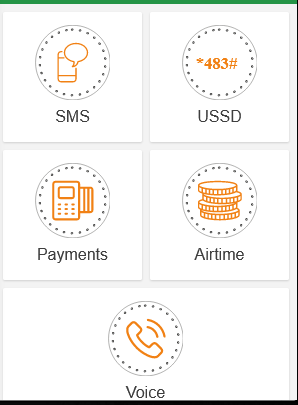
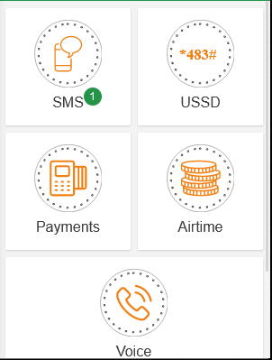

### Implementing Africa's talking SMS API using Node.js

### Introduction

Africa's Talking SMS API is an infrastructure provided by [Africa's Talking](https://africastalking.com/) to enable software platforms to communicate with their users using SMSes.

In this article, we will implement Africa's talking SMS API step by step using TypeScript and Node.js on a RESTful API. 

By the end of this article, we will have created a RESTful API that sends a message, receives incoming messages, and shows a delivery report for a message delivered.

### Prerequisites

To continue in this article, it is recommended to have the following:

- Basic knowledge working with TypeScript.

- [Node.js](https://nodejs.org/en/) installed on your computer.

### Overview

- [Setting up an account on Africas talking](#setting-up-an-account-on-africas-talking)

- [Setting up the Node.js application](#setting-up-the-nodejs-application)

- [Sending an SMS](#sending-an-sms)

- [Receiving an SMS](#receiving-an-sms)

- [Getting delivery reports](#getting-delivery-reports)

- [Conclusion](#conclusion)

### Setting up an account on Africa's talking

If you already have an account with Africa's Talking:

- Login from [here](https://account.africastalking.com/auth/login).

- On the redirected [page](https://account.africastalking.com/) click on [Go to sandbox app](https://account.africastalking.com/apps/sandbox)

Else, if you don't have an account, follow the below steps:

- Visit the registration page from [here](https://account.africastalking.com/auth/register).

- Enter the required details and click *Register*.

- Verify your email address by clicking on the link sent to your email address.

- On the redirected dashboard [page](https://account.africastalking.com/), click on [Go to sandbox app](https://account.africastalking.com/apps/sandbox).

### Setting up the Node.js application

We will use the following third-party packages:

- [ngrok](https://www.npmjs.com/package/ngrok): For exposing our local development server to Africa's talking SMS API.

- [express](https://www.npmjs.com/package/express): For setting up the RESTful architecture using Node.js must easily and efficient.

- [africastalking-ts](https://www.npmjs.com/package/africastalking-ts): For consuming Africas Talking SMS API with TypeScript support.

Proceed to your desired project location and run the following command to initialize your node project with default configurations:

```bash
npm init -y
```

Install the packages by running the following command:

```bash
npm i ngrok express africastalking-ts
```

To enable TypeScript support on our project, install the following dev dependencies:

```bash
npm i --save-dev @types/express @types/node ts-node typescript 
```

In *package.json*, under *scripts*, add the following:

```js
"start":"ts-node ./src/index.ts", // For starting the development server
"ngrok":"ngrok http 3000" // For starting the ngrok server
```

Create an *src* directory inside the project folder:

```bash
mkdir src
```

Proceed to the *src* directory, and create an *index.ts* file:

```bash
touch index.ts
```

### Sending an SMS

In the *src/index.ts* file:

- Import *express* with the corresponding types: *Application*, *Request*, and *Response*:

    ```ts
    import express,{Application,Request,Response} from 'express';
    ```

- Import *Client* from the Africas-talking package:

    ```ts
    import {Client}  from 'africastalking-ts';
    ```

- Initialize a *Client* using your *apiKey* and *username*:

    ```ts
    const africasTalking = new Client({
        apiKey:"your_api_key",
        username:"sandbox"
    });
    ```

    To get your API key:

    - From your [Sandbox's page](https://account.africastalking.com/apps/sandbox), on the left menu, click on *Settings* and then *API Key*. Enter your password and then click *Generate*. Copy the generated *API Key* and paste it into the above configuration.

    - Since we will be in a *sandbox* environment, our username will be *sandbox*.

- Initialize the *express* application:

    ```ts
    const app:Application = express();
    ```

- Enable parsing incoming requests with JSON payloads:

    ```ts
    app.use(express.json());
    ```

- Enable parsing incoming requests with URL encoded payloads:

    ```ts
    app.use(express.urlencoded({extended:true}));
    ```

- Set up a get route to send a message:

    ```ts
    app.get('/send-a-message', (req:Request, res:Response) => {
        try{
            await africasTalking.sendSms({
                to:["your-phone-number-with-currency-code"], // Your phone number
                message:"Hello there, We are on sandbox", // Your message
                from:"your-shortcode-or-alphanumeric" // Your shortcode or alphanumeric
            });
            return res.status(200).json({message:"Well done message sent"}); // Success message
        }catch(error){
            return res.status(500).json({message:"An error occurred"}); // Error message
        }
    })
    ```

    From above, we are calling *sendSMS* function from *africasTalking* client on a *try/catch* block since it is promise-based.

    Inside the function, we are sending the following parameters:

    - *to*: Recipient, your mobile phone number. Ensure you include your country code.

    - *message*: Short message you wish to deliver.

    - *shortcode/alphanumeric*: A shortcode is meant for sending and receiving messages whereas an alphanumeric is meant for only sending messages. To generate a shortcode:

        - Go to your [sandbox app](https://account.africastalking.com/apps/sandbox)

        - On the left pane, Click on *SMS*.

        - Click on *Shortcodes*, and then [*Create shortcode*](https://account.africastalking.com/apps/sandbox/sms/shortcodes/create).

        - Enter your preferred *Shortcode* ranging 4 to 5 digits and submit it.

        - Once accepted, copy the shortcode and paste it into the above configuration.

    - In case you want to create an alphanumeric:

        - Follow the same steps as in the prior step of using shortcode, but then click on *Alphanumerics* and then [*Create alphanumeric*](https://account.africastalking.com/apps/sandbox/sms/alphanumerics/create). 

        - Enter any preferred alphanumeric and then click *Submit*. Once successfully created, it should be listed in the table that follows.

        - Copy the alphanumeric and paste it in the above configuration.

- Start the application by listening to port *3000*:

    ```ts
    app.listen(3000, () => {
        console.log('The application is listening on port 3000!');
    })
    ```

- Run the following command to start the development server:

    ```bash
    npm run start
    ```

- To view the message sent, we must launch the simulator. From your [sandbox page](https://account.africastalking.com/apps/sandbox), on the left pane, click on *Launch Simulator*. In the proceeding popup, enter your phone number and then click *Launch*. You will receive a phone simulator with such an interface:

    

- From your browser, visit the following link: *http://localhost:3000/send-a-message*. If everything is okay, you will receive the following:

    

    and in your simulator, you will get a new message:

    

    which you can just click and read.

    If you got an error, revisit the steps once again.

### Receiving an SMS 

Start by adding a route to listen to incoming messages:

```ts
app.post('/incoming-messages', (req:Request,res:Response) => {
    const data = req.body;
    console.log(`Received message \n`,data); 
    res.sendStatus(200);
});
```

From above, we have set a *POST* route. In it, we are simply logging the received message and sending a successful status.

The route must be a *POST* route for the API server to reach it successfully.

Restart the development server by pressing *CTRL+C* and then start it using the below command:

```bash
npm run dev
```

Open a separate tab on your terminal and start *ngrok* using the below command:

```bash
npm run ngrok
```

To be able to receive an SMS we will need to add a *callback*. The *callback* will be our exposed server by ngrok.

Copy the *HTTPS* URL logged when you started ngrok e.g *https://e9ab-102-222-146-62.ngrok.io*

From your [Sandbox page](https://account.africastalking.com/apps/sandbox), on the left pane, click on *SMS*. In the resulting dropdown, click on *SMS Callback URLs*, and then click *Incoming Messages*. In the resulting form, paste in your callback and then append */incoming-messages* to target the route, and then click *Submit*.

To receive the incoming message, we will have to send a message. You must also ensure you are using a shortcode while sending a message because it enables you to send and receive the message. With alphanumeric, you won't receive the message.

Ensure you have launched your simulator.

Click on the *SMS* tab on the simulator, in the resulting screen, click on the floating plus action button and then select *New message*, enter your shortcode on the *To* input, and then your *Message* below, and then hit *Send*.

In your console, you should receive data with a similar format as below:

```js
{     
  linkId: 'specific-link-id',
  text: 'your-message',
  to: 'your-shortcode',
  id: 'specific message id',    
  date: 'date sent',
  from: 'your-phone-number'
}
```

In a production application, you can configure your server to create an alert via a notification service that a new message has been received.

### Getting delivery reports

Delivery reports are yielded every time you send an SMS and it successfully reaches its recipient.

We will start by adding a route for listening to delivery reports.

```ts
app.post('/delivery-reports',(req:Request,res:Response) => {
    const data = req.body;
    console.log(`Received delivery report `,data);
    res.sendStatus(200);
});
```

From above, we are getting the data sent from the API and logging it to the console.

Restart your development server by pressing *CTRL+C* and then running the below command to start it:

```bash
npm run dev
```

Copy the *HTTPS* URL you used in the previous step and proceed to your [Sandbox page](https://account.africastalking.com/apps/sandbox). On the left pane, click on *SMS*, *SMS Callback URLs*, and then *Delivery Reports*. 

In the form that follows, paste the *HTTPS* link and append */delivery-reports*. Then click *Submit*.

Ensure you have launched the simulator.

To get a delivery report, we will have to send an SMS. For this, from your browser open *http://localhost:3000/send-a-message*.

Once you have sent the message has been successfully sent, a response with a  structure similar will be logged on your console:

```js
{
  phoneNumber: 'your-phone-number',
  retryCount: '0',
  id: 'unique-id',
  status: 'Success',
  networkCode: 'random-number'
}
```

In a production application, you can generate a report once every message is marked as delivered.

### References

To gain more insights on the technologies we have used throughout the article, consider the following reference points:

- [Ngrok](https://ngrok.com/docs)

- [Express JS Rest API With TypeScript](/how-to-create-a-simple-rest-api-using-typescript-and-nodejs/)

- [Africa's Talking SMS API](https://developers.africastalking.com/tutorials?products=sms)

### Conclusion

In this article, we have implemented the SMS API from Africa's Talking using the following use-cases:

- [Sending a message](#sending-a-message)

- [Receiving incoming message](#receiving-incoming-message)

- [Getting delivery report](#getting-delivery-report)

Feel free to access the entire code from this [GitHub repository](https://github.com/mwangiKibui/africastalking-sms-api-nodejs-ts).

Happy coding!
