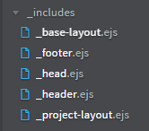
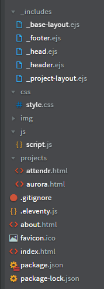
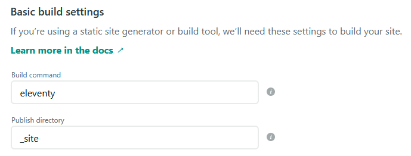
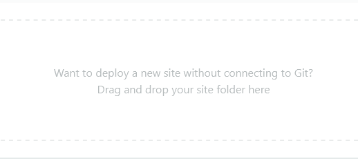

Static sites are typically much easier to develop and deploy than full-stack dynamic web apps. You can take advantage of free hosting services from providers like [Section](/modules/node-js) and [Netlify](https://www.netlify.co). Plus, if you use a CSS framework like [Bootstrap](https://getbootstrap.com) or [Materialize](https://materializecss.com), it only takes a basic knowledge of HTML and CSS to code a simple website.

<!--more-->

However, for more complex multi-page websites, a static site may not be suitable. Every time you want to add content, a new page has to be created and coded. If you change something that appears on multiple pages then you’d have to change it everywhere. That’s where static site generators come in. They bring the power of templating to static sites.

There are many static site generators (SSGs), including [Hugo](https://gohugo.io), [Gatsby](https://gatsbyjs.org) and [Next.js](https://nextjs.org) to name a few, but we will use [Eleventy](https://www.11ty.dev) for this example.

Eleventy uses vanilla JavaScript and allows multiple template languages to be mixed and matched so you don’t have to learn a new language or templating system. Static site generators work by taking the layout templates you’ve created and building the pages using the template and data you’ve provided.

Templating (see *[Converting a Static Site to a Dynamic NodeJS Web App](/static-site-dynamic-nodejs-web-app/)* for more info) lets you reuse code by inserting it into multiple places and add dynamic data. There are a variety of templating languages such as [Nunchucks](https://mozilla.github.io/nunjucks), [Liquid](https://shopify.github.io/liquid), [Pug](https://pugjs.org/api/getting-started.html) and [Handlebars](https://handlebarsjs.com), but the one we’ll be using in this example is [EJS](https://ejs.co).

### Installing Eleventy

The first step is to install Eleventy which will be done through the package manager, NPM. New to NPM? Check out my [installation guide](/static-site-dynamic-nodejs-web-app/).

Create a package.json:
```
npm init -y
```

Then install Eleventy:
```
npm install --save-dev @11ty/eleventy
```

To test the install, run:
```
npx @11ty/eleventy
```
which should return:
```bash
Processed X files in number of seconds (version number)
```

### Serving Your Static Site using Eleventy

The second step is to be able to serve your current site using Eleventy.

To do so, you'll have to create a config file and add some settings to it which will tell Eleventy how to handle your images, CSS and JavaScript.

In the root folder of your site, create a JavaScript file called `.eleventy.js` and include the following:

```js
module.exports = function (eleventyConfig) {
    eleventyConfig.addPassthroughCopy('img');
    eleventyConfig.addPassthroughCopy('css');
    eleventyConfig.addPassthroughCopy('js');
    return {
        passthroughFileCopy: true
    };
};
```
This will tell Eleventy when it builds your website to copy the img, CSS and js folders across (which is called passthrough copy) so you can link to them in your code.

Now run:
```
npx @11ty/eleventy
```

This should result in a build of your website and output the result to the `_site` folder. Congratulations, you've just finished the first Eleventy build of your website.

**Tip:** If you're using the version control software [Git](/beginner-guide-to-git/) to manage your code, then it would be a good idea to add the `_site` folder to your .gitignore file. This will stop you from committing your `_site` folder to Git, which prevents the constant uncommitted changes warning.

### Creating Your First EJS Partial

Now that your site is up and running on Eleventy, we can get to the templating part.

EJS partials are a way of reusing pieces of code. For example, if you created an EJS partial of your website's header, then it could be referenced on all your website's pages. In the future, if you decided to add a new menu item, then you would only need to update one file.

Create a folder in the root of your website called `_includes`. This is where Eleventy looks for templates.

**Tip:** A naming convention you may wish to use is to add an `_` to your template files so `head.ejs` would be renamed to `_head.ejs`. This helps to further distinguish your template files from the main content files that will create pages on your website.

In your `_includes` folder, add a file called `_head.ejs`, and copy and paste the content of your website's head section. It should look like the example below. Don't worry if the content differs between pages such as the title tag. We will cover how to use EJS variables with Eleventy in the Adding More Front-Matter section below, so such values can be unique for each page.

```html
<meta charset="utf-8">
<meta name="author" content="Louise Findlay">
<meta name="viewport" content="width=device-width, initial-scale=1.0">
<meta name="description" content="This is a page description">
<meta name="keywords" content="random, keywords, for, SEO">
<link href="https://fonts.googleapis.com/css2?family=Fira+Sans&family=Lato&display=swap" rel="stylesheet">
<link rel="stylesheet" href="https://use.fontawesome.com/releases/v5.7.2/css/all.css" integrity="sha384-fnmOCqbTlWIlj8LyTjo7mOUStjsKC4pOpQbqyi7RrhN7udi9RwhKkMHpvLbHG9Sr" crossorigin="anonymous">
<link rel="stylesheet" type="text/css" href="/css/style.css">
<link rel="shortcut icon" type="image/x-icon" href="/favicon.ico?">
<script src="/js/script.js"></script>
<title>Louise Findlay</title>
```

Add new partial files for other repeated elements such as the header and footer. Your `_includes` folder should look similar to the image below.



### Creating Your First Layout (Template) File

With the partials created, you can now create your first layout file.

The first layout (often named _base-layout.ejs) will form the basic template of all your pages and will contain the EJS partials (head, header, footer) that you've just created.

**Tip:** Another naming convention that you may want to use is to add -layout at the end of your layout files. This helps to differentiate them from your partials.

In the `_includes` folder, create a file called `_base-layout.ejs` and add the following to it:

```html
<!doctype html>
<html lang="en">
<head>
    <% include _head.ejs %>
</head>
<body>
    <% include _header.ejs %>
    <main>
        <%- content %>
    </main>
    <% include _footer.ejs %>
</body>
</html>
```
If you're new to EJS, `<% include` is the syntax for including a partial file and `<%-` is for including an EJS variable. Content is a variable Eleventy uses to add the body content of HTML, Markdown, and other input files.

Congratulations, you've just created your first Eleventy layout file.

###  Rendering Your First Layout File

We have our basic layout template, but we need to tell Eleventy where to use it. This is where front-matter comes in.

Front-Matter allows you to define variables you can use in your layout templates both built-in (from Eleventy) and those you've created yourself. By default, Eleventy uses YAML for front-matter though you can change it to JSON or even JavaScript if you prefer.

The most basic front-matter variable, `layout`, will instruct Eleventy which layout file to use to render a page.

On one of the HTML pages of your site, remove the code you included in EJS partials (head, header, and footer if you followed the tutorial.)

Then, add the following layout front-matter at the beginning:

```yaml
---
layout: _base-layout.ejs
---
```
The three dashes define the start and the end of the front-matter.

In your terminal, run:
```
npx @11ty/eleventy --serve
```
This command tells Eleventy to build your site and to start a local web-server using [Browsersync](https://www.browsersync.io) which will trigger a build when changes have been made and automatically refresh the current page.

Go to `http://localhost:8080/nameofhtmlfile` to view the page. It should display the head, header, and footer as well as the content of the page.

Congratulations, you've successfully converted your first static HTML page to use an EJS Eleventy layout file.

### Adding More Front Matter

Remember how we templated your website's header so that all the meta tags would be the same? Now that you've added your first piece of front-matter, we can add some more to account for unique values like different page titles.

First, In your partial pages (such as `_head.ejs`), remove everything inside the content attribute of your meta tags and replace it with EJS variables like the example below:

```html
<meta property="og:title" content="<%- title %>">
<meta property="og:description" content="<%- short_description %>">
```
Adding `-` after `<%` defines it as an EJS variable rather than a partial file which we did before. The values such as title and short-description are the names of the variables which we will use in the front-matter.

Next, on one of your HTML pages, add the EJS variables you've just created and the content you want to add like so:
```yaml
---
layout: _base-layout.ejs
title: About Louise Findlay - Front-End Web Developer
short_description: Louise Findlay has designed and developed over 20 static websites.
---
```
Finally, check on your website. The new front-matter content you've just added should be reflected in the code. If it's not, make sure you've run `npx @11ty/eleventy --serve` in the terminal to make your website automatically reload on changes. This step was covered earlier in the Rendering Your First Layout File section.

### Creating a Page Template (Layout Chaining)

Congratulations, you've finished creating the basic layout template for your website. Your site's head, header, and footer sections have been templated. But what about if you had a group of pages like products that had a similar content layout? You don't want to style the homepage this way nor write the same HTML for every product page. This is where layout chaining comes in.

Layout chaining is how you can combine multiple layout files. You create a secondary (or as many layers as you want) layout file which uses the base layout in the exact same way as you linked it to an HTML page.

Create a file called `_(layoutname)-layout.ejs` in the `_includes` folder and add the layout front-matter to link it to your base layout (in the exact same way you did for your HTML file.) The entire folder structure of your site should resemble the below.



Then add all the code that is identical throughout all your template pages. For example, if every product page had a section with three images, then add the section and div tags but remove the image tags since each image is unique.  In its place, add an EJS variable tag such as `<%- product_image1 %>`. See the example below:

```html
<section id="test1" class="product">
        <div class="flex-item">
            <picture>
                <%- product_image1 %>
            </picture>
            <picture>
                <%- product_image2 %>
            </picture>
            <picture>
                <%- product_image3 %>
            </picture>
        </div>
</section>
```
Add the image tags to the front-matter of the HTML page and change the `layout:` value to `_(layoutname)-layout.ejs`. See the example front-matter below:

```yaml
---
layout: _product-layout.ejs
title: New Product - Louise Findlay
description: Product Description
keywords: Louise Findlay, product, SSG, Eleventy, demo
product_image1: 
product_image2: 
product_image3: 
---
```

Remove the HTML you've just templated from the HTML page and check your website. It should now display the HTML from the layout file with the images you added in the page's front-matter.

Congratulations, you've successfully created a template through layout chaining. You can now create new templates for different parts of your website. The beauty of Eleventy is you can template as little or as much as you like.

### Deploying Your First Static Site Generator Website
Now that you've converted your first static website to use a static site generator, you need to deploy it to a web hosting platform.

There are many hosts for static sites but we will use [Netlify](https://www.netlify.com) for this example.

If you're using Git for source control and using a provider like Github (which is highly recommended), then once you've created a Netlify account, click Sites and then New Site from Git. In basic build settings, change the build command to eleventy and the publish directory to `_site`. This instructs Netlify how to build your site after every change you've pushed to Github.



Otherwise, just drag and drop the `_site` folder into the space instructed on the Sites page on Netlify. This will deploy your website but won't automatically update once you've made changes. You'll have to update your website's files manually every time.



Congratulations, you've finished converting your first static site to a static site generator and deployed it to the web. Think of it as a great middle ground between a static site and a full-blown CMS (content management system) or full-stack web app.
