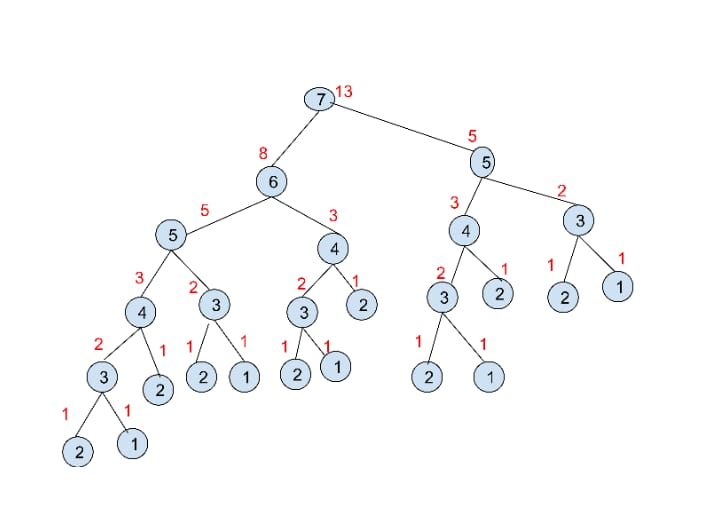
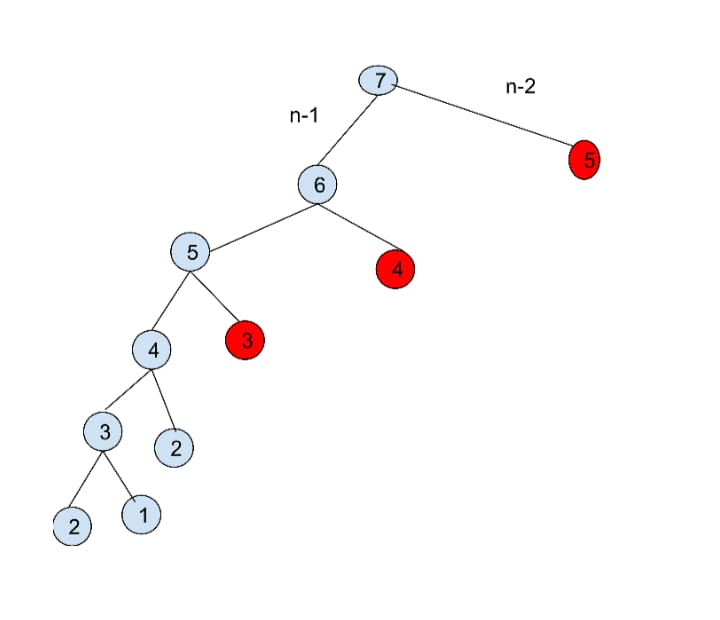

Memoization is an enhancement procedure used to speed up computer programs by keeping the values of distinct function calls and then returning the stored input when the same function is invoked again. 
<!--more-->
In a software development, time complexity describes the amount of time taken by the computer to run an algorithm.

In this tutorial, we will use dynamic programming to solve the Fibonacci sequence, as well as learn about the time complexity of our solutions. 

Dynamic programming problems are mostly solved using two ways; *tabulation**(bottom-up) and **memoization**(top-down). In this tutorial, we will focus on memoization.

### Prerequisites
To effectively understand the tutorial, the reader needs:

- Some basic understanding of JavaScript.
- A suitable IDE such as VS Code.
- Familiarity with the recursive approach.

### key takeaways
- What are Fibonacci numbers?
- What is the time complexity?
- How to implement memoization in JavaScript.
- How to use recursion to solve Dynamic programming questions.
- Understand how time complexity is reduced by memoization.

#### Fibonacci sequence - Time complexity analysis

```js
fib (n)

{
if n<=1
    return n
else
    return fib(n-1)+fib(n-2)
}
```

In the above code, if *n* is less or equal to *1*, we simply return *n*, or else we make two recursive calls to calculate *fib of n-1* and *fib of n-2*. 

#### Time complexity calculation
When we analyze the time complexity of programs, we assume that each simple operation takes one unit of time. 

Therefore, if we call the `fib()` function of *n*, *n* being greater than 1, we will first perform a comparison with 1 in `n<=1`. 

Since *n* is greater than 1 it goes to the *else* condition control of the program. This is when we perform two recursive calls and pass arguments `n-1` and `n-2`.

**Recursive formula for writing fibonacci numbers mathematically**

```bash
For seed values F(0) = 0 and F(1) = 1
F(n) = F(n-1) + F(n-2)
```

Let's say the time taken to calculate the *fib* of *n* is `T(n)`. The recursive equation of a Fibonacci number is `T(n)=T(n-1)+T(n-2)+O(1)`. 

This is because the time taken to compute `fib(n)` equals the quantity of time we will take to compute `fib(n-1)` and `fib(n-2)`. We should also include constant time to perform the addition.

Fibonacci is now defined as:

```bash
F(n) = F(n-1)+F(n-2)
```

The characteristic equation for this function will be:

```bash
x^2 = x+1
x^2 – x–1 = 0
```

### Dynamic programming
When engaging in dynamic programming, you need to:
- Write recursive code.
- Memoize the return value which is used to reduce recursive calls.

#### Classic recursive implementation of a Fibonacci function
*1* is always the first and second number of the Fibonacci sequence :

```bash
n :1,2,3,4,5,6, 7, 8,9
fib (n):1,1,2,3,5,8,13,21,34...
```

We add the previous two numbers in the sequence, e.g 5+8=13 to generate the next number of the sequence. The number needs to take a position of the sequence e.g the 7th Fibonacci number is 13.

**Example:**

```js
const fib =(n)=>{
    if (n<=2)return 1;
}
```

In the above code, we are taking in a numerical value and returning the number of the Fibonacci sequence. 

In other words, if the sum of *n* is less than or equal to 2, then we will return 1. 

```js
 return fib (n-1)+fib(n-2)
```

The function in the above code can determine the 3rd Fibonacci number by adding the 1st and 2nd figures. It runs to ensure that both the 1st and 2nd numbers are 1. 

It then sums them up and returns them to the original instance of the function which now adds 2 and 1.
 
 Let's now test our code to check it's efficiency. We will calculate the Fib of *five, six*, and *seven*. The output should be *5, 8*, and *13*.

 ```js
 console.log(fib(5));
 console.log(fib(6));
 console.log(fib(7));
 ```

The above code displays the expected results. Let's now allocate a bigger number to the `fib()` function. We will determine the *70th* Fibonacci number:

```js
console.log(fib(70));
```

Looks like the first three calls of Fibonacci work fine. However, the fourth call takes a lot of time. We, therefore, need to modify the Fibonacci function.

### Visualizing the fib function
We will use a recursive tree to visualize our problem. Let's trace through what happens when we call `fib` with number 7. 

We will branch out our tree starting at number 7. The first step is to subtract 1 `(n-1)` at the left branch and 2 `(n-2)` at the right branch. 

Use the same logic on other nodes of the structure. Our base cases are 2 and 1 because we cannot branch out any further.

In this case, we will build the entire tree and stop branching out whenever we have a base case scenario. 

**Call tree without Memoization**


In our tree, we will have one and two as our base cases. They will return 1 to the parent. We then add the two values returned to the call/parent. 

>Note that all base cases return 1 to their parents.

We will now add up our right and left children as we go up the tree. We will add the values until we reach the top of our tree, the final result is 13  as we indicated at the beginning that the `fib 7-> 13`.



#### Time complexity
Classic recursive implementation usually has `0(2^n)` time complexity as shown above. For us to find the time complexity of our algorithm let's ask ourselves how many times will we be calling `fib()`?

Our tree's first level is one call: fib 7. We have two calls in the next level fib 6 and fib 5 and four calls in the next level. We have two additional nodes each time our node branches off, so it's `2*2*2... = 2^n.` making it `O(2^n)`, it's not usually `2^n`. You can see that in level 5 a node is missing and in level 6 there is only one node. This means that our tree is asymmetric.

####  Memoization
`0(2^n)` is not a desirable time complexity. This means if we ask for fib 70 it will take `2^70` steps to be executed. and hence we will get a very large number because it takes a lot of steps. Let's look for any repeated sub-trees  in  the recursive nature of our tree. The subtrees duplicate themselves in the figure above.

Let's now implement  memoization. What we will do is capture a duplicate subtree, reuse these calculations then store that because later on, it might be useful when we will need to recalculate we can just use our stored data.

We will be using a JavaScript object to memoize our code. Our keys to the object will be the argument to our function and then the value will be our return value. Let's now add some optional arguments to our existing `fib()` function. Hence, we will assign a memo to an empty object as shown below:
```js
const fib=(n,memo={})=>{
}
```
This means if we call the `fib()` function without  passing in an argument,  a `memo` will be created by default in the code above.  The `memo` will be created containing a new empty javascript object. Let's treat it as if the `memo` is going to store `n` as the key and the values are going to be  the return values for the `fib()` function.

We are going to check the existence of our argument `n` inside of our `memo` by adding a base case. And if it is there, then we can just get the stored value from that `memo` hence we will do an early return.
```js
if(n in memo)return memo[n];
// memo fetching logic
```
We used the original argument `n` as a key in our `memo` to return the value that correlates with the memo's key.

**NB: `(n in the memo)` condition is just some classic javascript syntax. We are checking if some key is inside of the javascript object**

Let's  store our entire result inside of our memo, our key is `n`. We will complete our initial return so we will go ahead and return what we have put in that memo, so we will not be changing any return values. But  we are also saving the value inside of the `memo` object.
**NB: The access key should always be your argument.**
```js
memo [n]= fib(n-1)-fib(n-2);
return memo[n];
```
What I want to do now as seen in the code below is make sure that all of these recursive function calls are accessing the same memo. So, we  will now pass in memo object to both of these calls.
```js
memo[n]=fib(n-1,memo)+fib(n-2,memo);
```
We only receive a top-level `memo` object whenever we make a top-level call at a fib because we are not passing in a second argument as shown in the `return memo[n];`.

However, we do pass in explicit second arguments in our recursive calls and so they will receive the same `memo` object and it will look like it's passed by reference. This is because when a Javascript object is passed to a function you receive a similar object.

##### Below is our complete memoized code:
```js
const fib=(n, memo ={})=>{
if(n in memo)return memo[n];
```
- In the above code changes, I made is I added a new argument and a new base case in the line above.

```js
if(n <=2) return 1;
memo[n]=fib(n-1, memo) + fib(n-2, memo);
return memo[n];
};
```
- Added memo storing logic in `memo[n]=fib(n-1, memo) + fib(n-2, memo);
` but I did not substitute any of the functional logic.
- When we also check our test cases we see our runtime as improved greatly.

#### Tree implementation


The  nodes with the red color around them are  returning the memoized result. If you ignore them, as you can see the algorithm gets called once for each value from 0 to n.

When you write a call tree for something larger or smaller than fib(7). Maybe fib(10) or fib(20). You'll see that it looks just like our tree in the image above.

#### Time complexity calculation 
Let's take  time complexity  of `n` to be`T(n)` , hence` T(n) = T(n-1) + T(n-2).` This is because `F(n-2)` is  the one which is in the cache when we calculate `F(n - 1)`, so the function of `F(n-2)` is 1(reading from cached equation), hence `T(n) = T(n-1) + 1 = T(n-2) + 2 = ... = T(n-n) + n.` And `T(0) is 1`, hence `T(n) = O(n + 1) = O(n)`.

#### conclusion
The pattern of overlapping problems to reduce the time complexity of the Fibonacci series from O(2n) to O(n) is known as Dynamic programming. For us, the dynamic program is going to be any instance where we have some larger Fibonacci problem and we can decompose it into smaller instances of the same problem, hence we will have an overlapping structure.

happy learning!

---
Peer Review Contributions by: [Wanja Mike](/engineering-education/authors/michael-barasa/)
